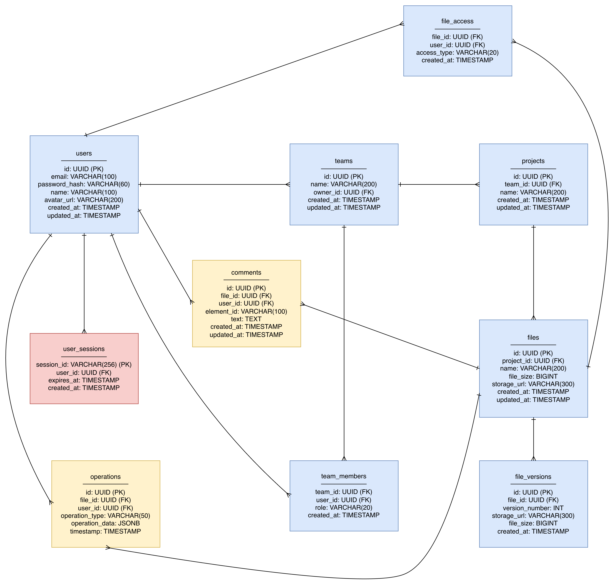
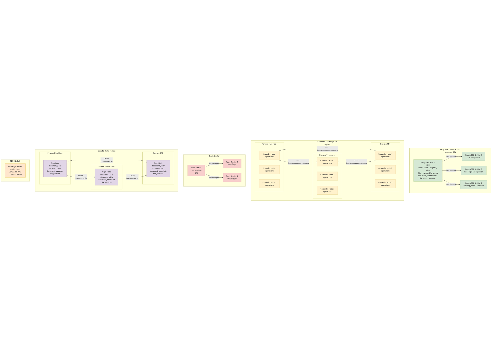
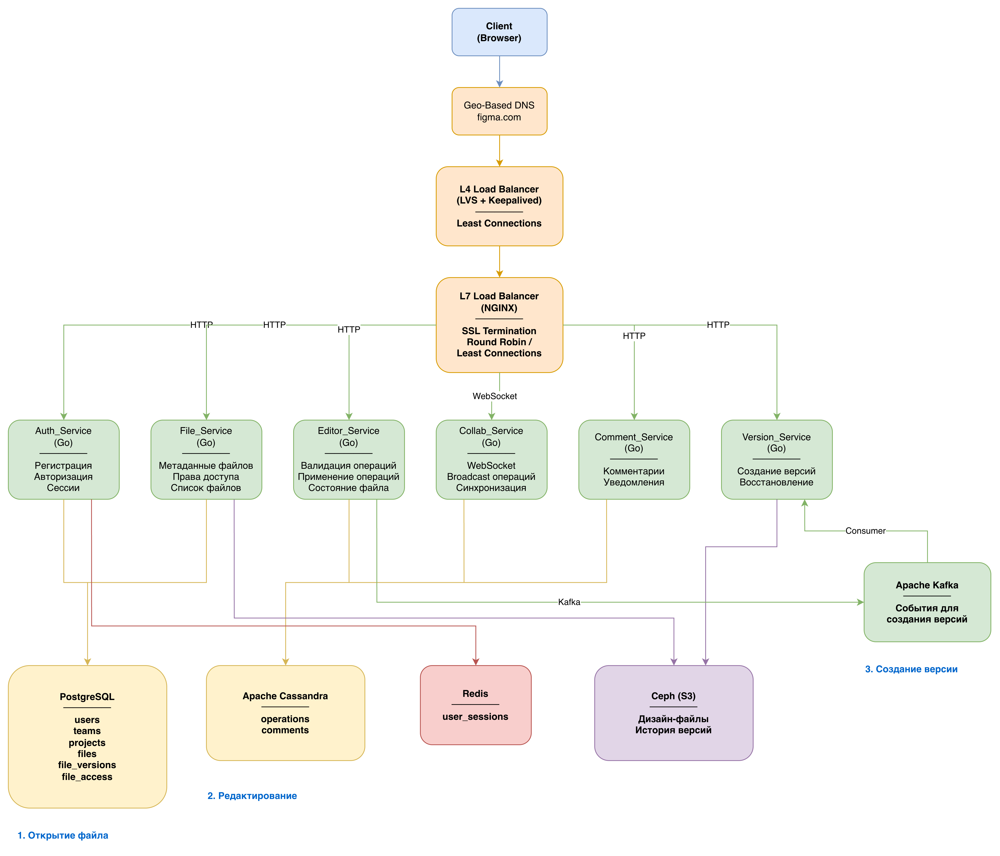

# Figma
## **1. Тема и целевая аудитория**

### **Тип сервиса**
Веб-приложение для коллаборативного UI/UX-дизайна (SaaS).  
**Аналоги:** Sketch, Adobe XD.  
**Рыночная ниша:** 40.65% доли рынка дизайнерских инструментов [SQ Magazine].

### Функционал MVP

1.  **Создание и редактирование векторного дизайна в браузере.**
2.  **Реалтайм-коллаборация** (одновременное редактирование с видимостью курсоров).
3.  **Комментирование** (привязка комментариев к элементам).
4.  **Developer Handoff** (экспорт CSS/SVG, отображение отступов).

### **Продуктовые решения**

*   **Клиент — веб-приложение** .
*   **Коллаборация в реальном времени.**
*   **Хранение истории версий** .
*   **Разделение прав доступа** (владелец, редактор, зритель).
*   **Интеграция ИИ** (agentic AI — 51% пользователей Figma) [Figma Blog].

### **Целевая аудитория**

| Параметр | Значение | Источник |
|----------|----------|----------|
| **MAU** | 13,000,000 | [SQ Magazine] |
| **DAU** | 4,300,000 (оценка: 1/3 от MAU) | Расчет на основе [SQ Magazine] |
| **География** | 38% — США, 7% — Индия, 6% — Великобритания | [Enlyft] |
| **Количество компаний-пользователей** | 67,681 | [Enlyft] |
| **Проникновение в Fortune 500** | 95% | [SQ Magazine] |

## **2. Расчет нагрузки**

### **Продуктовые метрики**

| Метрика | Значение | Источник |
|---------|----------|------------------------|
| **Среднее количество сессий на пользователя в день** | 1.5 | Оценка на основе типичного рабочего дня |
| **Средняя длительность сессии** | 50 минут | [SQ Magazine]: 16 мин 7 сек на сайте → 3x для активной работы в приложении |
| **Среднее количество операций на пользователя в час** | 150 | Оценка на основе активности дизайнера (рисование, перемещение, группировка) |
| **Средний размер файла** | 8 МБ | Оценка на основе сложности проектов |
| **Среднее количество файлов на пользователя** | 20 | Оценка на основе активности |

### **Технические метрики**

#### **Объем хранилища**

| Тип данных | Кол-во объектов | Средний размер | Общий объем |
|------------|-----------------|----------------|-------------|
| **Дизайн-файлы** | 260,000,000 | 8 МБ | **2,080 ТБ** |
| **История версий (10 версий/файл)** | 2,600,000,000 | 2 МБ | **5,200 ТБ** |
| **Комментарии (50 на файл)** | 13,000,000,000 | 1 КБ | **13 ТБ** |
| **Аватарки/настройки пользователей** | 13,000,000 | 1 МБ | **13 ТБ** |
| **ИТОГО** | — | — | **~7,300 ТБ (7.3 ПБ)** |

#### **Сетевой трафик**

| Тип трафика | Среднее значение (ГБ/день) | Пиковое значение (Гбит/с) |
|-------------|-----------------------------|----------------------------|
| **Загрузка файлов (чтение)** | 103,200 | — |
| **Выгрузка изменений (запись)** | 8,062.5 | — |
| **Broadcast изменений** | 20,156.25 | — |
| **ИТОГО исходящий трафик** | **131,419 ГБ/день (131 ТБ/день)** | **~110 Гбит/с** (пиковое) |

#### **RPS (Requests Per Second)**

| Тип запроса | Средний RPS | Пиковый RPS (x3) |
|-------------|-------------|------------------|
| **GET /file/{id}** (открытие файла) | 149 | 447 |
| **POST /operation** (сохранение операции) | 9,323 | 27,969 |
| **WebSocket push** (broadcast изменений) | 23,308 | 69,924 |
| **GET /files** (список файлов) | 149 | 447 |
| **POST /comment** (добавление комментария) | 372 | 1,116 |
| **ИТОГО** | **~33,301 RPS** | **~99,903 RPS** |

## **3. Глобальная балансировка нагрузки**

**Ключевые архитектурные принципы:**
1. все решения направлены на минимизацию задержки для коллаборации в настоящем времени
2. операции записываются локально в каждом регионе для минимальной задержки
3. операции редактирования могут реплицироваться асинхронно между регионами
4. метаданные файлов и права доступа требуют строгой консистентности

**3.1. Функциональное разбиение по доменам**

1.  **Домен аутентификации и пользователей** (`auth`): отвечает за вход, регистрацию, управление профилями.
2.  **Домен файлов и проектов** (`files`): создание, хранение, список файлов, права доступа.
3.  **Домен редактора** (`editor`): ядро приложения — работа с холстом, векторная графика, операции дизайнера.
4.  **Домен реалтайм-коллаборации** (`collab`): синхронизация действий между пользователями через WebSocketы.
5.  **Домен комментариев** (`comments`): добавление и отображение комментариев к элементам.

**3.2. Обоснование расположения ДЦ**

Главная задача — сделать так, чтобы приложение не лагало при работе из любой точки мира, так как это напрямую влияет на основные метрики:

*   **Для удержания пользователей:** Низкая задержка критична для редактора и коллаборации. Если курсор коллеги двигается с задержкой или элементы рисуются медленно, пользователи будут недовольны и могут уйти. Исследования показывают, что задержка >100 мс в реалтайм-приложениях приводит к снижению вовлеченности на 20-30%.

*   **Для повышения вовлеченности:** Быстрая загрузка файлов и отклик интерфейса увеличивают время сессии и активность. Задержка загрузки файла приводит к потере пользователей.

**Архитектурное решение:** Распределение ДЦ по регионам с максимальной концентрацией пользователей (США 38%, Европа 6%+, Россия остальное) минимизирует сетевую задержку. Каждый регион обслуживается локально, что дает меньшую задержку чем при централизованной архитектуре.

Поэтому используем несколько дата-центров:

*   **Основной ДЦ в Москве (Россия):** Для основной аудитории и как центральный узел для записи данных.
*   **ДЦ в Нью-Йорке (США):** Для пользователей из Северной Америки (38% аудитории).
*   **ДЦ в Франкфурте (Европа):** Для пользователей из Европы и части Азии.

**3.3. Распределение нагрузки по ДЦ**

| Тип запроса | Москва | Нью-Йорк | Франкфурт |
|-------------|--------|----------|-----------|
| **GET /file/{id}** (447 RPS) | 150 | 170 | 127 |
| **POST /operation** (27,969 RPS) | 9,323 | 10,625 | 8,021 |
| **WebSocket push** (69,924 RPS) | 23,308 | 26,570 | 20,046 |
| **GET /files** (447 RPS) | 149 | 170 | 128 |
| **POST /comment** (1,116 RPS) | 372 | 424 | 320 |
| **ИТОГО** | **33,302 RPS** | **37,960 RPS** | **28,642 RPS** |

> Распределение сделано пропорционально географии пользователей: США (38%), Европа (6% + часть остальных), Россия (остальное).

**3.4. Схема DNS балансировки**

Используется **Geo-Based DNS** для глобального распределения пользователей по регионам:
- Пользователи из США направляются на `figma.com` → Нью-Йорк
- Пользователи из Европы направляются на `figma.com` → Франкфурт
- Пользователи из России и остальных регионов направляются на `figma.com` → Москва

**3.5. Схема Anycast балансировки**

**Архитектурное обоснование отказа от Anycast:**

Anycast не используется по следующим причинам:
- нет смысла балансировать между несколькими ДЦ в одном регионе, так как задержка между регионами велика
- Geo-Based DNS позволяет направлять пользователей в ближайший ДЦ с возможностью фолбэка при отказе региона
- Anycast может менять endpoint при изменении маршрутизации, что разорвет WebSocket-соединения и нарушит коллаборацию
- Локальная запись в Cassandra требует знать, какие ноды находятся в локальном регионе

Альтернатива (Anycast) добавила бы нестабильность без выигрыша в задержке.

**3.6. Механизм регулировки трафика между ДЦ**

**Архитектурное решение: распределенная запись для низкой задержки**

Ключевое нефункциональное требование системы — **минимальная задержка**. Для реалтайм-коллаборации критично, чтобы операции редактирования сохранялись и синхронизировались с минимальной задержкой. Поэтому:

- **Операции записи** (`POST /operation`, `POST /comment`) записываются в **ближайший региональный ДЦ** в Cassandra. Это ключевая фишка Cassandra — она позволяет писать локально с уровнем консистентности, а затем асинхронно реплицировать данные в другие регионы. Альтернатива (запись только в Москву) добавила бы задержки для пользователей из США/Европы, что неприемлемо для реалтайм-редактора.

- **Операции чтения** (`GET /file/{id}`, `GET /files`) обслуживаются из ближайшего ДЦ с кэшированием через CDN

- **WebSocket-соединения** устанавливаются в ближайшем ДЦ. Синхронизация операций происходит через региональный сервис, который читает операции из локальной Cassandra и broadcastит их подключенным пользователям

- **PostgreSQL** (метаданные файлов, пользователи) так как эти операции не критичны по задержке и требуют строгой консистентности

---

## **4. Локальная балансировка нагрузки**

### **4.1. Схема балансировки**

После попадания пользователя в региональный ДЦ через Geo-Based DNS, запрос обрабатывается следующим образом:

1. **L4-балансировщик**:
   - LVS работает на сетевом уровне (Layer 4), не анализируя содержимое пакетов, что дает максимальную производительность. Альтернатива (только NGINX L7) добавила бы задержку на анализ HTTP-заголовков и снизила бы пропускную способность. LVS распределяет трафик между L7-балансировщиками, что оптимально для WebSocket-соединений с разной длительностью.
   - Обеспечивает отказоустойчивость через виртуальный IP — при отказе одного L4-балансировщика Keepalived автоматически переключает трафик на резервный
   - Формула резервирования: N+1

2. **CDN**:
   -В системе много статики (JS/CSS бандлы, ассеты, превью изображений файлов). NGINX может не справиться с пиковыми нагрузками на статику, особенно при DDoS-атаках. CDN решает обе проблемы:
     - Разгружает NGINX от статики
     - Защита от DDoS 
     - Кэширование статики на edge-серверах по всему миру снижает задержку загрузки
   - TTL для статики: 24 часа, для метаданных файлов: 5 минут

3. **L7-балансировщик** (NGINX):
   - Распределяет запросы по backend-сервисам:
     - для WebSocket-соединений (при коллаборации)
     - для обычных HTTP-запросов
   - Кэширует метаданные файлов (а статику — в CDN)
   - Формула резервирования: N+1

4. **Backend-сервисы** (Kubernetes Pods):
   - Автоматическое масштабирование
   - Формула резервирования: N+1

### **4.2. Расчет количества балансировщиков (на примере Москвы)**

**Допущения:**
- Один NGINX L7-инстанс способен обрабатывать **10,000 RPS** при SSL termination
- Целевая загрузка: **70%** (U = 0.7)
- Запас на всплески: **15%** (S = 1.15)

**Расчет для L7-балансировщиков:**

Формула: `N = ⌈(RPS_пик × S) / (RPS_балансировщика × U)⌉`

Подстановка значений:
- RPS_пик = 33,302
- S = 1.15 (запас на всплески)
- RPS_балансировщика = 10,000
- U = 0.7 (целевая загрузка)

Расчет: `N = ⌈(33,302 × 1.15) / (10,000 × 0.7)⌉ = ⌈38,297 / 7,000⌉ = ⌈5.47⌉ = 6`

С учетом отказоустойчивости и распределения по 3 зонам доступности: **9 инстансов NGINX L7** (3 в каждой AZ).

**Расчет для L4-балансировщиков:**
- Входящий трафик: **33,302 RPS**
- Производительность L4: **15,000 RPS** на инстанс
- Расчет: `N = ⌈(33,302 × 1.15) / (15,000 × 0.7)⌉ = ⌈38,297 / 10,500⌉ = ⌈3.65⌉ = 4`

С учетом отказоустойчивости: **6 инстансов L4** (2 в каждой AZ).

---

## **5. Логическая схема БД**

| Таблица | Назначение |
|---------|------------|
| **users** | Хранение данных пользователей, аутентификация |
| **teams** | Команды/организации пользователей |
| **team_members** | Связь пользователей с командами и ролями |
| **projects** | Проекты (контейнеры для файлов) |
| **files** | Метаданные дизайн-файлов |
| **file_versions** | История версий файлов |
| **file_access** | Права доступа к файлам (владелец, редактор, зритель) |
| **operations** | Операции редактирования (для синхронизации) |
| **comments** | Комментарии к элементам файлов |
| **user_sessions** | Активные сессии пользователей |

### **Размеры таблиц и QPS**

| Название таблицы | Расчеты | Итог | Количество строк | Нагрузка на запись (QPS) | Нагрузка на чтение (QPS) |
|------------------|---------|------|------------------|--------------------------|--------------------------|
| **users** | Состав: ID(8) + Email(100) + PasswordHash(60) + Name(100) + AvatarURL(200) + CreatedAt/UpdatedAt(16) = **≈484 B** Количество: 13,000,000 пользователей | **≈6.3 ГБ** | **13,000,000** | **5** (регистрация) | **50** (авторизация, профили) |
| **teams** | Состав: ID(8) + Name(200) + OwnerID(8) + CreatedAt/UpdatedAt(16) = **≈232 B** Количество: 67,681 команд | **≈15 МБ** | **67,681** | **1** | **10** |
| **team_members** | Состав: TeamID(8) + UserID(8) + Role(20) + CreatedAt(8) = **≈44 B** Количество: 13M × 1.5 = **19,500,000** | **≈858 МБ** | **19,500,000** | **10** | **20** |
| **projects** | Состав: ID(8) + TeamID(8) + Name(200) + CreatedAt/UpdatedAt(16) = **≈232 B** Количество: 67,681 × 10 = **676,810** | **≈157 МБ** | **676,810** | **5** | **50** |
| **files** | Состав: ID(8) + ProjectID(8) + Name(200) + FileSize(8) + StorageURL(300) + CreatedAt/UpdatedAt(16) = **≈556 B** Количество: 260,000,000 файлов | **≈145 ГБ** | **260,000,000** | **150** (создание) | **447** (открытие) + **149** (список) = **596** |
| **file_versions** | Состав: ID(8) + FileID(8) + VersionNumber(4) + StorageURL(300) + FileSize(8) + CreatedAt(8) = **≈336 B** Количество: 2,600,000,000 версий | **≈874 ГБ** | **2,600,000,000** | **150** | **447** |
| **file_access** | Состав: FileID(8) + UserID(8) + AccessType(20) + CreatedAt(8) = **≈44 B** Количество: 260M × 2.5 = **650,000,000** | **≈29 ГБ** | **650,000,000** | **50** | **596** |
| **operations** | Состав: ID(8) + FileID(8) + UserID(8) + OperationType(50) + OperationData(500) + Timestamp(8) = **≈574 B** Количество: (9,323 RPS × 86400 × 30 дней) = **≈24.2 млрд** | **≈13.9 ТБ** | **24,200,000,000** | **27,969** (пик) | **9,323** (чтение для синхронизации) |
| **comments** | Состав: ID(8) + FileID(8) + UserID(8) + ElementID(100) + Text(500) + CreatedAt/UpdatedAt(16) = **≈640 B** Количество: 13,000,000,000 комментариев | **≈8.3 ТБ** | **13,000,000,000** | **1,116** (пик) | **372** |
| **user_sessions** | Состав: SessionID(256) + UserID(8) + ExpiresAt(8) + CreatedAt(8) = **≈280 B** Количество: 4.3M DAU × 1.5 сессий = **6,450,000** активных сессий | **≈1.8 ГБ** | **6,450,000** | **50** | **500** (проверка сессий) |

### **Требования к консистентности**

| Таблица | Консистентность | Обоснование |
|---------|-----------------|-------------|
| **users** | Strong | Критично для безопасности |
| **teams, team_members** | Strong | Управление правами доступа |
| **projects, files** | Strong | Метаданные должны быть консистентны |
| **file_versions** | Strong | История версий критична |
| **file_access** | Strong | Права доступа должны быть актуальны |
| **operations** | Eventual | Операции могут быть применены с небольшой задержкой |
| **comments** | Eventual | Комментарии могут появиться с задержкой |
| **user_sessions** | Session | Достаточна консистентность в рамках сессии |

---

## **6. Физическая схема БД**

### **Выбор СУБД**

| Таблица | СУБД | Обоснование |
|---------|------|----------------|
| **users, teams, team_members, projects, files, file_versions, file_access** | PostgreSQL | Реляционные данные требуют транзакций и сложных JOIN-запросов (например, проверка прав доступа с объединением file_access и users). PostgreSQL отлично справляется с такими запросами благодаря индексам и оптимизатору. Альтернатива (Cassandra) не подходит — нет JOIN'ов, сложные запросы неэффективны. |
| **operations** | Apache Cassandra | Критично низкая задержка записи. Cassandra позволяет писать локально в каждом регионе с `LOCAL_QUORUM`, что дает меньшую задержку при записи в удаленный мастер. Высокая нагрузка требует горизонтального масштабирования — Cassandra справляется лучше PostgreSQL. |
| **comments** | Apache Cassandra | Аналогично operations — низкая задержка записи критична для UX. Комментарии могут появляться с небольшой задержкой репликации между регионами, что приемлемо. Большой объем данных и высокая нагрузка на запись требуют распределенной СУБД. |
| **user_sessions** | Redis | Быстрый доступ, TTL для автоматического удаления |

### **Индексы**

| База данных | Таблица | Индексы | Обоснование |
|-------------|---------|---------|-----------|
| **PostgreSQL** | users | `CREATE INDEX idx_users_email ON users(email);` `CREATE INDEX idx_users_session ON user_sessions(session_id);` | Поиск по email при авторизации, проверка сессий |
| **PostgreSQL** | files | `CREATE INDEX idx_files_project_id ON files(project_id);` `CREATE INDEX idx_files_created_at ON files(created_at DESC);` | Поиск файлов в проекте, сортировка по дате |
| **PostgreSQL** | file_versions | `CREATE INDEX idx_file_versions_file_id ON file_versions(file_id, version_number DESC);` | Получение версий файла |
| **PostgreSQL** | file_access | `CREATE INDEX idx_file_access_file_user ON file_access(file_id, user_id);` | Проверка прав доступа |
| **Cassandra** | operations | `PRIMARY KEY ((file_id), timestamp, operation_id)` | Партиционирование по file_id, сортировка по времени |
| **Cassandra** | comments | `PRIMARY KEY ((file_id), created_at, comment_id)` | Партиционирование по file_id, сортировка по дате |

### **Шардирование**

| Таблица | Подход |
|---------|--------|
| **files** | Шардирование по `project_id` при помощи Citus |
| **file_versions** | Шардирование по `file_id` при помощи Citus |
| **file_access** | Шардирование по `file_id` при помощи Citus |
| **operations** | Автошардирование (Cassandra) по `file_id` |
| **comments** | Автошардирование (Cassandra) по `file_id` |

### **Резервирование**

| Таблица | Схема резервирования |
|---------|----------------------|
| **PostgreSQL** | Master-Slave с 2 репликами (синхронная и асинхронная) на шард |
| **Cassandra** | **Multi-region replication:** Replication Factor = 3 в каждом регионе. Запись происходит локально в ближайшем регионе с `LOCAL_QUORUM` (2 из 3 нод в регионе), что дает меньшую задержку при записи в удаленный мастер. Асинхронная репликация между регионами обеспечивает низкую задержку записи при сохранении отказоустойчивости. При отказе одной ноды в регионе система продолжает работать . При полном отказе региона данные доступны из других регионов с небольшой задержкой. |
| **Redis** | Master-Slave с автоматическим аварийным переключением через Sentinel |

### **Клиентские библиотеки / интеграции**

- **PostgreSQL**: `pgx` (Go драйвер) + PgBouncer для пуллинга подключений
- **Cassandra**: `gocql` (Go драйвер) с балансировкой на уровне драйвера
- **Redis**: `go-redis` (Go клиент)

### **Схема резервного копирования**

| База данных | Частота |
|-------------|---------|
| **PostgreSQL** | Backup 1×/день  |
| **Cassandra** | Snapshots 1×/день |
| **Redis** | snapshot каждые 6 часов + команды, изменяющие данные каждую секунду |

---

## **7. Алгоритмы**

| Алгоритм | Область применения | Обоснование |
|----------|-------------------|-----------|
| **Operational Transform (OT)** | Реалтайм-коллаборация | Обеспечивает консистентность при одновременном редактировании файла несколькими пользователями. Операции трансформируются относительно друг друга, что позволяет избежать конфликтов. Критично для снижения задержки — операции применяются локально без ожидания подтверждения от сервера, что дает небольшой отклик. Альтернатива (блокировки) добавила бы большую задержку на каждую операцию, что неприемлемо для реалтайм-редактора. |
| **CRDT (Conflict-free Replicated Data Types)** | Синхронизация состояния редактора | Альтернатива OT для некоторых типов операций (например, добавление элементов в список). RDT работает лучше OT для операций, где порядок не критичен, так как не требует трансформации операций. |
| **Differential Sync** | Синхронизация изменений файлов | Передача только изменений вместо полного файла снижает трафик. Это критично для понижения задержки — передача занимает меньшее время для полного файла. Альтернатива (передача полного файла) увеличила бы задержку загрузки и сетевой трафик, что неприемлемо при долгом открытий файлов. |
| **Lazy Loading** | Загрузка элементов холста | Загружаются только видимые элементы и элементы вблизи viewport, что ускоряет открытие файлов . Критично для UX — пользователь видит файл почти мгновенно, остальные элементы подгружаются по мере необходимости. Альтернатива (загрузка всех элементов) увеличила бы время открытия файла в большое количество раз, что неприемлемо для профессионального инструмента. |
| **Version Control (Snapshot-based)** | История версий | Периодическое создание снимков состояния файла для быстрого восстановления предыдущих версий. |

---

## **8. Технологии**

| Технология | Область применения | Обоснование |
|------------|-------------------|---------------------|
| **Golang** | Backend | Компилируемый язык с высокой производительностью и отличной поддержкой конкурентности (goroutines). Идеален для обработки большого количества WebSocket-соединений (69,924 RPS пик) и операций редактирования. Альтернативы (Node.js, Python) имеют проблемы: Node.js — callback hell и проблемы с CPU-bound задачами, Python — GIL ограничивает параллелизм. Go дает низкую задержку и эффективное использование ресурсов, что критично для low latency requirement. |
| **TypeScript + React** | Frontend | TypeScript обеспечивает типобезопасность, React — эффективный рендеринг UI. Виртуальный DOM оптимизирует обновления интерфейса при частых изменениях состояния. |
| **WebSocket** | Реалтайм-коллаборация | Двусторонняя связь критична для реалтайм-коллаборации. Альтернативы (HTTP long polling, Server-Sent Events) добавляют задержку из-за overhead на установку соединения. WebSocket устанавливается один раз и поддерживает низкую задержку передачи операций, что критично для синхронизации курсоров и изменений между пользователями. |
| **NGINX** | L7 балансировка нагрузки, прокси | SSL-терминация, обратное проксирование, кэширование метаданных. Высокая производительность для обработки HTTP/WebSocket трафика (10,000 RPS на инстанс). Альтернативы (HAProxy, Envoy) либо менее производительны, либо избыточны по функционалу. NGINX — оптимальный баланс производительности и простоты конфигурации. Статика отдается через CDN, NGINX обрабатывает только динамические запросы. |
| **Linux Virtual Server (LVS)** | L4 балансировка нагрузки | Работает на сетевом уровне, обеспечивает высокую производительность для распределения трафика между L7-балансировщиками. |
| **Kubernetes** | Оркестрация | Автоматическое масштабирование сервисов критично для обработки пиковых нагрузок. HPA позволяет масштабировать под нагрузкой без ручного вмешательства, что критично для SaaS с переменной нагрузкой. Альтернативы (Docker Swarm, ручное управление) требуют ручного масштабирования, что приводит к простоям при всплесках нагрузки или перерасходу ресурсов в спокойное время. |
| **PostgreSQL** | Основная база данных | Реляционная СУБД с поддержкой транзакций, сложных запросов и индексов. Критично для метаданных файлов и пользователей, где нужны JOIN'ы (например, проверка прав доступа: file_access JOIN users). Альтернативы (MongoDB, Cassandra) не подходят — нет транзакций или сложных запросов. PostgreSQL обеспечивает ACID-гарантии, что критично для финансовых операций и прав доступа. |
| **Apache Cassandra** | Хранение операций и комментариев | Ключевая фишка Cassandra — возможность локальной записи в каждом регионе с `LOCAL_QUORUM`, что критично для low latency requirement. Альтернатива (PostgreSQL с мастером в одном регионе) добавила бы 50-150 мс задержки для пользователей из других регионов, что неприемлемо для реалтайм-редактора. Горизонтальное масштабирование и высокая пропускная способность записи (27,969 QPS) делают Cassandra оптимальным выбором. |
| **CDN (Cloudflare / AWS CloudFront)** | Отдача статики и защита от DDoS | Статика (JS/CSS бандлы, ассеты) составляет до 70% трафика. NGINX может не справиться с пиковыми нагрузками, особенно при DDoS. CDN решает обе проблемы: разгружает NGINX и обеспечивает защиту на уровне edge-нод. Кэширование на edge-серверах по всему миру снижает задержку загрузки для пользователей. |
| **Redis** | Кэш и сессии | Быстрое хранилище в памяти для кэширования метаданных файлов и хранения активных сессий. Задержка <1 мс критична для проверки сессий на каждом запросе (500 QPS чтения). Альтернативы (Memcached, in-memory cache) либо не имеют персистентности, либо менее функциональны. Redis с TTL идеален для сессий — автоматическое удаление истекающих сессий без дополнительной логики. |
| **Ceph (S3)** | Хранение файлов | S3-совместимое хранилище с горизонтальным масштабированием и отказоустойчивостью. Объем данных огромен (7.3 ПБ), требуется распределенное хранилище. Технология CRUSH автоматически перераспределяет данные при добавлении нод. Альтернативы (локальные диски, NFS) не масштабируются и создают single point of failure. Ceph обеспечивает репликацию 3× и автоматическое восстановление при отказе нод. |
| **Kafka** | Асинхронный обмен данными | Используется для передачи событий между сервисами (создание версий, индексация для поиска). Высокая пропускная способность и гарантированная доставка сообщений. |
| **Prometheus** | Мониторинг | Сбор метрик сервисов, поддержка alerting, интеграция с Kubernetes. |
| **Grafana** | Мониторинг | Построение дашбордов по метрикам, аналитика и гибкая настройка уведомлений. Интеграция с Prometheus. |

---

## **9. Обеспечение надежности**

| Компонент | Схема резервирования |
|-----------|---------------------|
| **Backend сервисы (Go)** | **N+1** — Управляется через Kubernetes с автоматическим перезапуском подов при сбоях |
| **NGINX (L7 балансировщик)** | **N+1** — Вне Kubernetes; трафик распределяется через LVS (L4) + Keepalived. Health-check'и для исключения неработающих бэкендов |
| **LVS (L4 балансировщик)** | **N+1** — Keepalived обеспечивает автоматический failover виртуального IP |
| **PostgreSQL** | **Primary–Replica (Patroni) с 2 репликами** — одна синхронная, одна асинхронная; автоматический failover. **PgBouncer** для пуллинга подключений. Ежедневный backup + WAL ≤ 15 мин |
| **Cassandra** | **Replication Factor = 3**, каждая запись хранится на 3 нодах. Snapshots 1×/день |
| **Redis** | **Master-Slave с Sentinel** — автоматический failover при отказе мастера |
| **Ceph** | **Репликация 3× (CRUSH)** — автоматическое распределение реплик по нодам |
| **Kafka** | **Replication Factor = 3** — каждая партиция хранится на трех брокерах |
| **Kubernetes** | **Автоматический перезапуск подов** при падении контейнеров. **Horizontal Pod Autoscaler (HPA)** для масштабирования под нагрузкой |

---

## **10. Схема проекта**

### **Описание сервисов**

| Сервис | Назначение |
|:--|:--|
| **Auth_Service** | Управление пользователями: регистрация, авторизация, управление сессиями. |
| **File_Service** | Управление метаданными файлов и проектов: создание, список, права доступа. |
| **Editor_Service** | Обработка операций редактирования: валидация, применение операций к файлам. |
| **Collab_Service** | Реалтайм-коллаборация: управление WebSocket-соединениями, broadcast операций между пользователями, синхронизация состояния редактора. |
| **Comment_Service** | Управление комментариями: добавление, отображение, уведомления. |
| **Version_Service** | Управление версиями файлов: создание снимков, восстановление версий. |

### **Потоки данных**

#### **Открытие файла**
1. Client → **CDN** (статичные ассеты: JS/CSS) → отдача из edge-кэша 
2. Client → `L4` → `L7` → **File_Service** [Auth] → проверка прав доступа
3. **File_Service** → **Ceph (S3)** → получение файла (или из регионального кэша)
4. Client получает файл и устанавливает WebSocket-соединение с **Collab_Service** в локальном регионе

#### **Редактирование файла**
1. Client → **Collab_Service** (WebSocket) → отправка операции
2. **Collab_Service** → **Editor_Service** → валидация и применение операции
3. **Editor_Service** → **Cassandra (operations) в локальном регионе** → сохранение операции с `LOCAL_QUORUM`
4. **Collab_Service** → broadcast операции всем подключенным пользователям файла в регионе
5. Асинхронно: **Cassandra** реплицирует операцию в другие регионы (eventual consistency)
6. Асинхронно: **Editor_Service** → **Kafka** → событие для создания версии

#### **Создание версии**
1. **Version_Service** (консьюмер Kafka) → получение события о накоплении операций
2. **Version_Service** → **Editor_Service** → получение текущего состояния файла
3. **Version_Service** → **Ceph (S3)** → сохранение снимка
4. **Version_Service** → **PostgreSQL (file_versions)** → сохранение метаданных версии

---

## **11. Список серверов**

### **Конфигурации технологий**

| Технология | Характер сервиса | RPS (на инстанс) | RAM (на инстанс) |
|------------|------------------|------------------|------------------|
| **CDN** | Отдача статики, защита от DDoS | Неограничено (edge-ноды) | — |
| **NGINX L4** | L4-балансер | 15,000 | 20 МБ |
| **NGINX L7** | L7-балансер | 10,000 | 500 МБ |
| **Go (WebSocket)** | Реалтайм-коллаборация | 1,000 соединений/ядро | 200 МБ/ядро |
| **Go (CRUD)** | Метаданные | 3,500 RPS/ядро | 100 МБ/ядро |
| **PostgreSQL** | Метаданные | 100 QPS/ядро | 18 ГБ/реплика |
| **Cassandra** | Операции и комментарии (локальная запись + чтение) | 1,400 QPS/ядро (запись), 2,800 QPS/ядро (чтение) | 6 ГБ/нода |

### **Расчет количества серверов (на примере Москвы)**

#### Определение нагрузки
- **API-запросы**: `447 + 447 + 1,116 = 2,010 RPS`
- **WebSocket-соединения**: `23,308 RPS` (подключения)
- **Операции записи**: `27,969 RPS`

#### NGINX L4
- **Входящий трафик**: `33,302 RPS`
- Производительность: **15,000 RPS**
- Расчет: `N = (33,302 × 1.15) / (15,000 × 0.7) = 3.65 = 4`
- → **6 инстансов** (2 в каждой AZ)

#### NGINX L7
- **Нагрузка**: `33,302 RPS`
- Производительность: **10,000 RPS**
- Расчет: `N = (33,302 × 1.15) / (10,000 × 0.7) = 5.47 = 6`
- → **9 инстансов** (3 в каждой AZ)

#### Go-сервисы (K8s Pods)

| Сервис | RPS | CPU (ядер) | RAM (ГБ) | Replicas | Replicas/AZ |
|--------|-----|------------|----------|----------|-------------|
| **Auth_Service** | 50 | 1 | 0.1 | 3 | 1 |
| **File_Service** | 596 | 1 | 0.1 | 3 | 1 |
| **Editor_Service** | 27,969 | 80 | 16 | 12 | 4 |
| **Collab_Service** | 23,308 | 24 | 4.8 | 9 | 3 |
| **Comment_Service** | 1,116 | 1 | 0.2 | 3 | 1 |
| **Version_Service** | 150 | 1 | 0.2 | 3 | 1 |

### **Итоговая таблица: серверы на регион (Москва)**

| Регион | L4 | L7 | Auth | File | Editor | Collab | Comment | Version |
|--------|----|----|------|------|--------|--------|---------|---------|
| **Москва** | 6 | 9 | 3 | 3 | 12 | 9 | 3 | 3 |

Аналогичные расчеты выполнены для Нью-Йорка и Франкфурта на основе их RPS.

### **Хранилища**

| Хранилище | Объём | QPS |
|-----------|-------|-----|
| PostgreSQL | 1.1 ТБ | 1,200 |
| Ceph | 7.3 ПБ | 28,000 |
| Cassandra | 22.2 ТБ | 28,000 |
| Redis | 1.8 ГБ | 500 |

### **Конфигурации узлов хранилищ**

| Название | Хостинг | Конфигурация | Cores | Cnt | Покупка |
|----------|---------|--------------|-------|-----|---------|
| **PostgreSQL** | own/bare metal | 1×EPYC 7543 / 256GB RAM / 4×NVMe 3.8TB / 2×25GbE | 32 | 4 | €7,200 |
| **Ceph (на регион)** | own/bare metal | 2×EPYC 7443 / 128GB RAM / 12×HDD 18TB + 4×NVMe 1.6TB / 2×100GbE | 48 | 86 | €13,000 |
| **Cassandra** | own/bare metal | 1×EPYC 7443 / 128GB RAM / 2×NVMe 1.6TB / 2×25GbE | 24 | 9 | €7,500 |
| **Redis** | own/bare metal | 1×EPYC 7443 / 64GB RAM / 1×NVMe 1.6TB / 2×10GbE | 24 | 3 | €3,200 |

---

## **Источники**
1.  **Figma Legal — Data Processing Addendum (DPA):**  
    [https://www.figma.com/legal/dpa/  ](https://www.figma.com/legal/dpa/  )  

2.  **Figma Blog — 2025 AI Report:**  
    [https://www.figma.com/blog/figma-2025-ai-report-perspectives/  ](https://www.figma.com/blog/figma-2025-ai-report-perspectives/  )  
    
3.  **Enlyft — Companies using Figma:**  
    [https://enlyft.com/tech/products/figma  ](https://enlyft.com/tech/products/figma  )  
  
4.  **SQ Magazine — Figma Statistics 2025:**  
    [https://sqmagazine.co.uk/figma-statistics/  ](https://sqmagazine.co.uk/figma-statistics/  )  
    
5.  **Exploding Topics — Most Visited Websites:**  
    [https://explodingtopics.com/blog/most-visited-websites  ](https://explodingtopics.com/blog/most-visited-websites  )  
  

