# Figma
## **1. Тема и целевая аудитория**

### **Тип сервиса**
Веб-приложение для коллаборативного UI/UX-дизайна (SaaS).  
**Аналоги:** Sketch, Adobe XD.  
**Рыночная ниша:** 40.65% доли рынка дизайнерских инструментов [SQ Magazine].

### Функционал MVP

1.  **Создание и редактирование векторного дизайна в браузере.**
2.  **Реалтайм-коллаборация** (одновременное редактирование с видимостью курсоров).
3.  **Комментирование** (привязка комментариев к элементам).
4.  **Developer Handoff** (экспорт CSS/SVG, отображение отступов).

### **Продуктовые решения**

*   **Клиент — веб-приложение** .
*   **Коллаборация в реальном времени.**
*   **Хранение истории версий** .
*   **Разделение прав доступа** (владелец, редактор, зритель).
*   **Интеграция ИИ** (agentic AI — 51% пользователей Figma) [Figma Blog].

### **Целевая аудитория**

| Параметр | Значение | Источник |
|----------|----------|----------|
| **MAU** | 13,000,000 | [SQ Magazine] |
| **DAU** | 4,300,000 (оценка: 1/3 от MAU) | Расчет на основе [SQ Magazine] |
| **География** | 38% — США, 6% — Великобритания, 7% — Индия, 49% — остальные (включая Россию ~15%) | [Enlyft] |
| **Количество компаний-пользователей** | 67,681 | [Enlyft] |
| **Проникновение в Fortune 500** | 95% | [SQ Magazine] |

## **2. Расчет нагрузки**

### **Продуктовые метрики**

| Метрика | Значение | Источник |
|---------|----------|------------------------|
| **Среднее количество сессий на пользователя в день** | 1.5 | Оценка на основе типичного рабочего дня |
| **Средняя длительность сессии** | 50 минут | [SQ Magazine]: 16 мин 7 сек на сайте → 3x для активной работы в приложении |
| **Среднее количество операций на пользователя в час** | 150 | Оценка на основе активности дизайнера (рисование, перемещение, группировка) |
| **Средний размер файла** | 8 МБ | Оценка на основе сложности проектов |
| **Среднее количество файлов на пользователя** | 20 | Оценка на основе активности |

### **Технические метрики**

#### **Объем хранилища**

| Тип данных | Кол-во объектов | Средний размер | Общий объем |
|------------|-----------------|----------------|-------------|
| **Дизайн-файлы** | 260,000,000 | 8 МБ | **2,080 ТБ** |
| **История версий (10 версий/файл)** | 2,600,000,000 | 2 МБ | **5,200 ТБ** |
| **Комментарии (50 на файл)** | 13,000,000,000 | 1 КБ | **13 ТБ** |
| **Аватарки/настройки пользователей** | 13,000,000 | 1 МБ | **13 ТБ** |
| **ИТОГО** | — | — | **~7,300 ТБ (7.3 ПБ)** |

#### **Сетевой трафик**

| Тип трафика | Среднее значение (ГБ/день) | Пиковое значение (Гбит/с) |
|-------------|-----------------------------|----------------------------|
| **Загрузка файлов (чтение)** | 103,200 | — |
| **Выгрузка изменений (запись)** | 8,062.5 | — |
| **Broadcast изменений** | 20,156.25 | — |
| **ИТОГО исходящий трафик** | **131,419 ГБ/день (131 ТБ/день)** | **~110 Гбит/с** (пиковое) |

#### **RPS (Requests Per Second)**

| Тип запроса | Средний RPS | Пиковый RPS (x3) |
|-------------|-------------|------------------|
| **GET /file/{id}** (открытие файла) | 149 | 447 |
| **POST /operation** (сохранение операции) | 9,323 | 27,969 |
| **WebSocket push** (broadcast изменений) | 23,308 | 69,924 |
| **GET /files** (список файлов) | 149 | 447 |
| **POST /comment** (добавление комментария) | 372 | 1,116 |
| **ИТОГО** | **~33,301 RPS** | **~99,903 RPS** |

## **3. Глобальная балансировка нагрузки**

### **3.1. Расположение датацентров и схема DNS балансировки**

Основано на географии пользователей и требованиях к низкой задержке для реалтайм-коллаборации.

| Регион | Расположение ДЦ | Пользователи (MAU) | Доля | GeoDNS маршрутизация (figma.com) | Failover ДЦ |
|--------|-----------------|---------------------|------|----------------------------------|-------------|
| **США** | Нью-Йорк | 4,940,000 | 38% | Северная Америка (США, Канада, Мексика) → Нью-Йорк | Франкфурт |
| **Европа** | Франкфурт | 2,600,000 | 20% | Европа, Азия, остальные регионы → Франкфурт | Нью-Йорк |
| **Россия и СНГ** | Санкт-Петербург | 1,950,000 | 15% | Россия и СНГ → Санкт-Петербург | Франкфурт |
| **Остальные** | Распределены по трем ДЦ | 3,510,000 | 27% | По географии DNS resolver'а (см. ниже) | По географии |

**Всего 3 ДЦ**, на каждый приходится не более 5M активных пользователей в месяц.

**Принцип работы GeoDNS:**

GeoDNS (Geographic DNS) — это механизм глобальной балансировки нагрузки на уровне DNS, который выдает разные IP адреса в зависимости от географического расположения DNS resolver'а (рекурсивного DNS сервера), который выполняет запрос.

**Как работает GeoDNS:**
1. Клиент отправляет DNS запрос на `figma.com` через локальный DNS resolver (обычно DNS сервер провайдера или публичный DNS типа 8.8.8.8)
2. DNS resolver отправляет запрос на авторитетный DNS сервер Figma
3. Авторитетный DNS сервер видит IP адрес DNS resolver'а (не конечного клиента)
4. Используя GeoIP базу данных (например, MaxMind GeoIP), определяется географическое расположение resolver'а
5. На основе географии resolver'а выдается IP адрес соответствующего регионального ДЦ
6. DNS resolver возвращает этот IP адрес клиенту

GeoDNS работает по географии DNS resolver'а, а не по latency. Это означает, что пользователи из одного географического региона будут направляться в один и тот же ДЦ.

**Принцип работы системы:**
- Документы (`document_body`, `document_snapshots`, `file_versions`) хранятся в **региональных Ceph S3 кластерах** — каждый регион имеет свой локальный Ceph кластер с репликацией 3× внутри региона. Документы асинхронно реплицируются между региональными кластерами для доступности, но чтение/запись происходит из локального регионального кластера для низкой задержки. Это позволяет избежать проблем с консенсусом в multi-region Ceph, который был бы слишком медленным.
- Операции редактирования (`operations`) хранятся в **multi-region Cassandra** кластере, запись происходит локально в каждом регионе с `LOCAL_QUORUM`
- Нет фиксированного "мастер-региона" у файла — пользователь всегда редактирует через региональный ДЦ, определенный GeoDNS на основе его географии, даже если файл был создан в другом регионе
- Консистентность обеспечивается через **CRDT** (Conflict-free Replicated Data Types) — операции автоматически конвергируют к одному состоянию при репликации
- Cassandra асинхронно реплицирует операции между регионами

**DNS маршрутизация:**
- `figma.com` → GeoDNS направляет по географии DNS resolver'а (см. таблицу выше)
- `api.figma.com` → всегда направляется в Санкт-Петербург (мастер PostgreSQL, Auth_Service, File_Service), не использует GeoDNS
- `static.figma.com`, `preview.figma.com` → CDN (Cloudflare) с собственной глобальной балансировкой

**DNS Failover:**
- При отказе основного ДЦ региона GeoDNS автоматически переключается на резервный ДЦ из таблицы выше
- Для `api.figma.com` при отказе СПб используется синхронная реплика PostgreSQL в Нью-Йорке или Франкфурте

### **3.2. Разбиение на поддомены / сервисы**

| Поддомен / сервис | Назначение | Характер трафика | RPS (пик) |
|-------------------|-----------|------------------|-----------|
| **figma.com** | Основной веб-сайт, UI, WebSocket для коллаборации | Высокий, read-heavy, stateful (WebSocket) | 99,903 |
| **api.figma.com** | Авторизация, регистрация, создание файлов и проектов, управление метаданными | Средний, write-heavy | 200 |
| **static.figma.com** | Статические ресурсы (JS/CSS бандлы, ассеты) | Очень высокий, cacheable | 500,000 |
| **preview.figma.com** | Превью файлов, миниатюры | Высокий, bandwidth-heavy | 50,000 |

**RPS рассчитан с учётом пикового числа одновременных пользователей** (см. раздел 2):
- **GET /file/{id}** (открытие файла): 447 RPS
- **POST /operation** (сохранение операции): 27,969 RPS
- **WebSocket push** (broadcast изменений): 69,924 RPS
- **GET /files** (список файлов): 447 RPS
- **POST /comment** (добавление комментария): 1,116 RPS

Основной трафик приходится на `figma.com` (редактирование и коллаборация), остальные сервисы поддерживают авторизацию, создание файлов и отдачу статики.

### **3.2. Механизм работы системы**

**Открытие файла:**
1. Клиент идет на `figma.com` → GeoDNS направляет его в соответствующий региональный ДЦ на основе географии DNS resolver'а
2. Региональный `Editor_Collab_Service`:
   - Читает метаданные файла из локальной реплики PostgreSQL
   - **Берет последний снапшот** (полное состояние документа на момент определенного transaction_counter) из локального регионального Ceph S3
   - Если снапшота нет в локальном регионе, запрашивает из другого региона (первый раз)
   - **Подгружает все операции (дифы)** с transaction_counter больше, чем у снапшота, из локальной Cassandra
3. **Восстановление состояния документа:**
   - Клиент берет снапшот как базовое состояние
   - Применяет все операции после transaction_counter снапшота последовательно через CRDT
   - Получает актуальное состояние документа без хранения всех версий целиком
4. Устанавливается WebSocket с локальным `Editor_Collab_Service`

**Редактирование файла:**
1. Клиент отправляет операцию по WebSocket в локальный `Editor_Collab_Service`
2. Сервис:
   - Формирует CRDT операцию с данными изменения (operation_data)
   - **Отправляет операцию в Cassandra с инкрементом transaction_counter** — приложение не присваивает счетчик, а отправляет инкремент, Cassandra сама обеспечивает монотонное возрастание через распределенный счетчик
   - **Vector_clock формируется автоматически** на основе текущего состояния vector clock клиента (который обновляется при получении операций) + идентификатора пользователя
   - Применяет операцию локально через CRDT (оптимистичное применение для мгновенного отклика)
   - Пишет в локальную Cassandra с `LOCAL_QUORUM` (задержка <5 мс)
   - Рассылает операцию всем локальным клиентам файла через WebSocket
   - Метаданные операции записываются в PostgreSQL мастер в СПб (асинхронно)
3. **CRDT в приложении:**
   - Приложение не реагирует на доезжание данных до узлов — вся логика разрешения конфликтов заложена в структуру данных operation_data
   - Операции спроектированы как идемпотентные и коммутативные — их можно применять в любом порядке
   - При получении операции из другого региона (через репликацию Cassandra) приложение применяет её через CRDT алгоритм, который автоматически разрешает конфликты на основе семантики операции
   - Переупорядочивание операций не ломает макет, так как CRDT операции коммутативны
4. Cassandra асинхронно реплицирует операцию в другие регионы
5. Клиенты в других регионах получают операцию через репликацию Cassandra и применяют её через CRDT — состояние сходится независимо от порядка получения операций

**Создание файла:**
1. Клиент идет на `api.figma.com` → направляется в Санкт-Петербург (мастер)
2. `File_Service` пишет метаданные в PostgreSQL мастер
3. Начальный снапшот/документ создается в Ceph S3 в регионе СПб
4. Метаданные реплицируются в PostgreSQL реплики, документ асинхронно реплицируется в Ceph других регионов для доступности

**Загрузка статики:**
1. Клиент запрашивает статику у CDN (`static.figma.com`)
2. CDN использует свою глобальную балансировку (Anycast или latency-based) для выбора edge-сервера
3. Ответ приходит с edge-сервера CDN, ближайшего к клиенту по сетевой задержке
4. Если объекта нет в кэше CDN, запрос идет на региональный ДЦ, определенный GeoDNS для этого клиента

## **4. Локальная балансировка нагрузки**

### **4.1. Схема балансировки**

После попадания пользователя в региональный ДЦ через GeoDNS (на основе географии DNS resolver'а), запрос обрабатывается следующим образом:

1. **CDN** (глобальная балансировка):
   - Статика (JS/CSS бандлы, ассеты, превью) отдается из edge-серверов CDN
   - CDN использует свою собственную глобальную балансировку (Anycast или latency-based) для выбора edge-сервера, ближайшего к клиенту по сетевой задержке
   - Защита от DDoS на уровне CDN
   - Если статика не в кэше CDN, запрос идет на региональный ДЦ, определенный GeoDNS для этого клиента

2. **L7-балансировщик** (NGINX):
   - Принимаем трафик сразу на L7 (без L4), так как NGINX справляется с нагрузкой
   - Распределяет запросы по backend-сервисам:
     - Least Connections для WebSocket-соединений
     - Round Robin для обычных HTTP-запросов
   - Кэширует метаданные файлов
   - Формула резервирования: N+1 

### **4.2. Расчет количества балансировщиков (на примере Москвы)**

**Расчет производительности NGINX L7:**

По бенчмаркам NGINX Inc.:
- NGINX с SSL termination (HTTPS) обрабатывает до **2,000-3,000 HTTPS CPS** (Connections Per Second) на инстансе среднего класса (2 vCPU, 8 ГБ RAM)
- Большая часть трафика — HTTPS соединения (WebSocket также использует HTTPS handshake)
- С учетом кэширования метаданных и реальной нагрузки берем значение: **2,000 HTTPS CPS** на инстанс
- Это соответствует 99-му процентилю latency < 100 мс

**Параметры расчета:**
- Целевая загрузка: **70%** (U = 0.7) — оставляем запас для всплесков
- Запас на всплески: **30%** (S = 1.3) — это разница между целевой загрузкой 70% и максимальной 100%

**Расчет для L7-балансировщиков (на примере Нью-Йорка):**

**Определение нагрузки в CPS:**
- WebSocket соединения: 26,570 новых подключений/сек (каждое подключение = 1 HTTPS connection)
- HTTP запросы: 340 RPS (каждый запрос = 1 HTTPS connection, но соединения могут переиспользоваться)
- С учетом переиспользования соединений для HTTP (keep-alive) и новых соединений для WebSocket:
  - Пиковая нагрузка в CPS: ~27,000 CPS (26,570 WebSocket + ~500 новых HTTP соединений)

Формула: `N = ⌈(CPS_пик × S) / (CPS_балансировщика × U)⌉`

Подстановка значений:
- CPS_пик = 27,000 (Нью-Йорк, редактирование)
- S = 1.3 (запас 30%)
- CPS_балансировщика = 2,000
- U = 0.7 (целевая загрузка 70%)

Расчет: `N = ⌈(27,000 × 1.3) / (2,000 × 0.7)⌉ = ⌈35,100 / 1,400⌉ = ⌈25.07⌉ = 26`

С учетом отказоустойчивости и распределения по 3 зонам доступности: **30 инстансов NGINX L7** (10 в каждой AZ).

**Примечание:** L4-балансировщик не используется, так как принимаем трафик сразу на L7.

## **5. Логическая схема БД**

```mermaid
%%{init: {'theme':'base', 'themeVariables': { 'fontSize': '38px', 'primaryColor': '#fff', 'primaryTextColor': '#000', 'primaryBorderColor': '#000', 'lineColor': '#000', 'secondaryColor': '#f4f4f4', 'tertiaryColor': '#fff', 'cScale0': '#fff', 'cScale1': '#fff', 'cScale2': '#fff'}}}%%
erDiagram
    users ||--o{ team_members : "has"
    users ||--o{ file_access : "has"
    users ||--o{ operations : "creates"
    users ||--o{ user_sessions : "has"
    users ||--|| user_counters : "has"
    
    teams ||--o{ team_members : "has"
    teams ||--o{ projects : "has"
    
    projects ||--o{ files : "contains"
    
    files ||--|| document_body : "has"
    files ||--o{ document_resources : "has"
    files ||--o{ document_snapshots : "has"
    files ||--o{ file_access : "has"
    files ||--o{ file_versions : "has"
    files ||--o{ operations : "belongs_to"
    
    document_snapshots ||--o{ operations : "referenced_by"
    
    static_assets ||--o{ files : "used_by"
    
    users {
        uuid id PK
        varchar email UK
        varchar password_hash
        varchar name
        varchar avatar_url
        datetime created_at
        datetime updated_at
    }
    
    user_counters {
        uuid user_id PK,FK
        integer files_count
        integer projects_count
    }
    
    teams {
        uuid id PK
        varchar name
        uuid owner_id FK
        datetime created_at
        datetime updated_at
    }
    
    team_members {
        uuid team_id PK,FK
        uuid user_id PK,FK
        varchar role
        datetime created_at
    }
    
    projects {
        uuid id PK
        uuid team_id FK
        varchar name
        datetime created_at
        datetime updated_at
    }
    
    files {
        uuid id PK
        uuid project_id FK
        varchar name
        bigint file_size
        varchar storage_url
        datetime created_at
        datetime updated_at
    }
    
    document_body {
        uuid file_id PK,FK
        text yaml_data "YAML структура документа"
        datetime created_at
        datetime updated_at
    }
    
    document_resources {
        uuid id PK
        uuid file_id FK
        uuid resource_id
        varchar resource_url
        varchar resource_type
        datetime created_at
    }
    
    document_snapshots {
        uuid id PK
        uuid file_id FK
        bigint transaction_counter "Счетчик транзакций (CRDT counter)"
        varchar storage_url "Ссылка на снапшот в Ceph"
        datetime created_at
    }
    
    file_versions {
        uuid id PK
        uuid file_id FK
        integer version_number
        varchar storage_url
        bigint file_size
        datetime created_at
    }
    
    file_access {
        uuid file_id PK,FK
        uuid user_id PK,FK
        varchar access_type "owner/editor/viewer"
        datetime created_at
    }
    
    operations {
        uuid id PK
        uuid file_id FK
        uuid user_id FK
        bigint transaction_counter "Счетчик транзакций для файла (CRDT counter, заменяет transaction_id)"
        bigint vector_clock "Vector clock для CRDT (timestamp в наносекундах + user_id hash)"
        varchar operation_type
        text operation_data "CRDT операция в формате JSON"
        boolean is_comment
        text comment_data
        uuid snapshot_id FK "Ссылка на снапшот, относительно которого применяется операция"
        datetime created_at
    }
    
    static_assets {
        uuid id PK
        varchar asset_url
        varchar asset_type
        varchar cdn_url
        datetime created_at
    }
    
    user_sessions {
        varchar session_id PK
        uuid user_id FK
        datetime expires_at
        datetime created_at
    }
```

| Таблица | Назначение |
|---------|------------|
| **users** | Хранение данных пользователей, аутентификация |
| **teams** | Команды/организации пользователей |
| **team_members** | Связь пользователей с командами и ролями |
| **projects** | Проекты (контейнеры для файлов) |
| **files** | Метаданные дизайн-файлов (бордов) |
| **document_body** | Тело документа в формате YAML — структура элементов холста |
| **document_resources** | Ресурсы документа (изображения, шрифты, иконки) — ссылки на файлы в Object Storage |
| **document_snapshots** | Снапшоты (снимки состояния) документа по transaction_counter — для быстрого восстановления, метаданные в PostgreSQL |
| **file_access** | Права доступа к файлам (владелец, редактор, зритель) |
| **operations** | Операции редактирования и комментарии (объединены) — для синхронизации и коллаборации |
| **static_assets** | Статика (JS/CSS бандлы, ассеты) — метаданные для CDN |
| **user_sessions** | Активные сессии пользователей |

### **Как устроен документ (файл/борд)**

Документ хранится по модели, похожей на git, с использованием CRDT для разрешения конфликтов. **Вместо хранения каждой версии файла целиком, храним снапшот (полное состояние) + последовательность операций (дифов) после снапшота.**

**Принцип работы:**

1. **Снапшот (snapshot)** — полное состояние документа в формате YAML на момент определенного счетчика транзакций
   - Создается периодически: каждые 1000 операций или раз в час (что наступит раньше)
   - Хранится в Object Storage (Ceph S3)
   - Имеет transaction_counter (счетчик транзакций), который указывает, до какой операции включительно состояние сохранено в снапшоте
   - **Снапшот = полная копия документа на момент создания**

2. **Операции (operations, дифы)** — последовательность изменений относительно снапшота, хранятся в Cassandra
   - Каждая операция содержит: transaction_counter (монотонно возрастающий счетчик для файла), vector_clock (для CRDT), тип операции, данные операции в формате CRDT JSON
   - **Операция = одно изменение документа** (добавление элемента, перемещение, изменение цвета и т.п.)
   - Операции применяются последовательно после transaction_counter снапшота
   - Используется CRDT (Conflict-free Replicated Data Types) для автоматического разрешения конфликтов при одновременном редактировании
   - Vector clock позволяет определить порядок операций и разрешить конфликты без централизованной координации
   - Метаданные операций (ID, file_id, transaction_counter, snapshot_id) также хранятся в PostgreSQL для быстрого поиска

3. **CRDT структура операций:**
   - **transaction_counter** — монотонно возрастающий счетчик для каждого файла. Приложение не присваивает transaction_counter напрямую, а отправляет в Cassandra операцию с инкрементом счетчика. Cassandra сама обеспечивает монотонное возрастание счетчика через распределенный счетчик (например, используя Lightweight Transactions или специальные счетчики Cassandra). Это гарантирует, что даже при одновременных операциях из разных регионов счетчики будут уникальными и упорядоченными.
   - **vector_clock** — структура данных для отслеживания причинно-следственных зависимостей между операциями в распределенной системе. Представляет собой вектор (массив) пар (node_id, counter), где node_id — идентификатор узла/пользователя, counter — счетчик операций от этого узла. Vector clock позволяет определить, произошла ли операция A до операции B, после, или они concurrent (одновременные). При concurrent операциях CRDT алгоритм автоматически разрешает конфликт на основе семантики операции (например, для множества элементов — объединение, для счетчика — максимум).
   - **operation_data** — JSON с CRDT операцией (например, добавление/удаление/изменение элемента с координатами и свойствами). Структура данных в operation_data спроектирована так, чтобы быть идемпотентной и коммутативной — это позволяет применять операции в любом порядке и получать одинаковый результат.

**Пример восстановления состояния:**
- Снапшот на transaction_counter #1000 (полное состояние документа на момент 1000-й операции, размер ~2 МБ)
- Операции с transaction_counter #1001 до #1050 (50 изменений, каждое ~1 КБ, итого ~50 КБ)
- **Чтобы получить актуальное состояние:**
  1. Берем снапшот #1000 (базовое состояние)
  2. Применяем все операции с #1001 до #1050 последовательно через CRDT
  3. Получаем актуальное состояние документа
- **Экономия:** Вместо хранения 50 версий по 2 МБ (100 МБ) храним 1 снапшот 2 МБ + 50 операций 50 КБ = ~2.05 МБ

**Восстановление любой версии:**
- Для восстановления версии на момент операции #1025: берем снапшот #1000 + применяем операции #1001-#1025
- Для восстановления текущей версии: берем последний снапшот + применяем все операции после него

### **Размеры таблиц и QPS**

| Название таблицы | Расчеты | Итог | Количество строк | Нагрузка на запись (QPS) | Нагрузка на чтение (QPS) |
|------------------|---------|------|------------------|--------------------------|--------------------------|
| **users** | Состав: ID(8) + Email(100) + PasswordHash(60) + Name(100) + AvatarURL(200) + CreatedAt/UpdatedAt(16) = **≈484 B** Количество: 13,000,000 пользователей | **≈6.3 ГБ** | **13,000,000** | **5** (регистрация) | **50** (авторизация, профили) |
| **teams** | Состав: ID(8) + Name(200) + OwnerID(8) + CreatedAt/UpdatedAt(16) = **≈232 B** Количество: 67,681 команд | **≈15 МБ** | **67,681** | **1** | **10** |
| **team_members** | Состав: TeamID(8) + UserID(8) + Role(20) + CreatedAt(8) = **≈44 B** Количество: 13M × 1.5 = **19,500,000** | **≈858 МБ** | **19,500,000** | **10** | **20** |
| **projects** | Состав: ID(8) + TeamID(8) + Name(200) + CreatedAt/UpdatedAt(16) = **≈232 B** Количество: 67,681 × 10 = **676,810** | **≈157 МБ** | **676,810** | **5** | **50** |
| **files** | Состав: ID(8) + ProjectID(8) + Name(200) + FileSize(8) + StorageURL(300) + CreatedAt/UpdatedAt(16) = **≈556 B** Количество: 260,000,000 файлов | **≈145 ГБ** | **260,000,000** | **150** (создание) | **447** (открытие) + **149** (список) = **596** |
| **file_versions** | Состав: ID(8) + FileID(8) + VersionNumber(4) + StorageURL(300) + FileSize(8) + CreatedAt(8) = **≈336 B** Количество: 2,600,000,000 версий | **≈874 ГБ** | **2,600,000,000** | **150** | **447** |
| **file_access** | Состав: FileID(8) + UserID(8) + AccessType(20) + CreatedAt(8) = **≈44 B** Количество: 260M × 2.5 = **650,000,000** | **≈29 ГБ** | **650,000,000** | **50** | **596** |
| **document_body** | Состав: FileID(8) + YAMLData(средний размер 2 МБ) = **≈2 МБ** Количество: 260,000,000 файлов | **≈520 ТБ** | **260,000,000** | **150** (создание) | **447** (открытие) |
| **document_resources** | Состав: FileID(8) + ResourceID(8) + ResourceURL(300) + ResourceType(50) = **≈366 B** Количество: 260M × 10 ресурсов = **2,600,000,000** | **≈951 ГБ** | **2,600,000,000** | **1,500** | **4,470** |
| **document_snapshots** | Состав: SnapshotID(8) + FileID(8) + TransactionCounter(8) + StorageURL(300) + CreatedAt(8) = **≈332 B** Количество: 260M × 10 снапшотов = **2,600,000,000** | **≈863 ГБ** | **2,600,000,000** | **150** | **447** |
| **operations** | Состав: ID(8) + FileID(8) + UserID(8) + TransactionCounter(8) + VectorClock(16) + OperationType(50) + OperationData(500) + IsComment(1) + CommentData(500) + SnapshotID(8) + CreatedAt(8) = **≈1,091 B** Количество: (9,323 + 372) RPS × 86400 × 30 дней = **≈25.1 млрд** **Хранение:** Полные данные в Cassandra (27.4 ТБ), метаданные в PostgreSQL (ID, file_id, transaction_counter, snapshot_id) = **≈44 B на строку** × 25.1 млрд = **≈1.1 ТБ** | **≈27.4 ТБ** (Cassandra) + **≈1.1 ТБ** (PostgreSQL метаданные) | **25,100,000,000** | **29,085** (пик: операции + комментарии) | **9,695** (чтение для синхронизации) |
| **static_assets** | Состав: AssetID(8) + AssetURL(300) + AssetType(50) + CDNURL(300) = **≈658 B** Количество: ~100,000 ассетов | **≈66 МБ** | **100,000** | **10** | **500** |
| **user_sessions** | Состав: SessionID(256) + UserID(8) + ExpiresAt(8) + CreatedAt(8) = **≈280 B** Количество: 4.3M DAU × 1.5 сессий = **6,450,000** активных сессий | **≈1.8 ГБ** | **6,450,000** | **50** | **500** (проверка сессий) |

### **Расчет нагрузки на PostgreSQL**

**Суммарная нагрузка на запись (QPS):**
- users: 5
- teams: 1
- team_members: 10
- projects: 5
- files: 150
- file_versions: 150
- file_access: 50
- document_snapshots: 150
- operations_metadata: 29,085 (метаданные операций записываются синхронно с операциями в Cassandra)
- static_assets: 10
- user_sessions: 50
- **ИТОГО на запись: 29,666 QPS**

**Суммарная нагрузка на чтение (QPS):**
- users: 50
- teams: 10
- team_members: 20
- projects: 50
- files: 596
- file_versions: 447
- file_access: 596
- document_snapshots: 447
- operations_metadata: 9,695 (чтение метаданных для синхронизации)
- static_assets: 500
- user_sessions: 500
- **ИТОГО на чтение: 12,915 QPS**

**Общая нагрузка: 42,581 QPS**

**Расчет количества ядер PostgreSQL:**
- По бенчмаркам PostgreSQL обрабатывает ~100 QPS на ядро для смешанной нагрузки (запись + чтение)
- Требуется: 42,581 / 100 = **426 ядер**
- С учетом целевой загрузки 70% и запаса 30%: 426 / 0.7 = **609 ядер**
- Распределение по репликам:
  - Мастер (СПб): 609 ядер (запись + чтение)
  - Реплика 1 (СПб синхронная): 609 ядер (только чтение)
  - Реплика 2 (Нью-Йорк): 609 ядер (только чтение)
  - Реплика 3 (Франкфурт): 609 ядер (только чтение)
  - **ИТОГО: 2,436 ядер** (или ~122 сервера по 20 ядер)

**Примечание:** Нагрузка на PostgreSQL высокая из-за operations_metadata (29,085 QPS записи). Это метаданные операций, которые записываются синхронно для быстрого поиска операций по файлу и transaction_counter. Полные данные операций хранятся в Cassandra.

### **Требования к консистентности**

| Таблица | Консистентность | Обоснование |
|---------|-----------------|-------------|
| **users** | Strong | Критично для безопасности |
| **teams, team_members** | Strong | Управление правами доступа |
| **projects, files** | Strong | Метаданные должны быть консистентны |
| **file_versions** | Strong | История версий критична |
| **file_access** | Strong | Права доступа должны быть актуальны |
| **document_body, document_resources** | Strong | Тело документа должно быть консистентно |
| **document_snapshots** | Strong | Метаданные снапшотов должны быть консистентны (хранятся в PostgreSQL) |
| **operations** | Eventual | Операции используют CRDT, могут реплицироваться с задержкой, конфликты разрешаются автоматически. Метаданные в PostgreSQL — Strong |
| **static_assets** | Eventual | Статика кэшируется в CDN, может быть устаревшей |
| **user_sessions** | Session | Достаточна консистентность в рамках сессии |

## **6. Физическая схема БД**

```mermaid
%%{init: {'theme':'base', 'themeVariables': { 'fontSize': '38px', 'primaryColor': '#fff', 'primaryTextColor': '#000', 'primaryBorderColor': '#000', 'lineColor': '#000', 'secondaryColor': '#f4f4f4', 'tertiaryColor': '#fff', 'cScale0': '#fff', 'cScale1': '#fff', 'cScale2': '#fff'}}}%%
graph TB
    subgraph "PostgreSQL Cluster (СПб - основная БД)"
        PG_MASTER[PostgreSQL Master<br/>СПб<br/>users, teams, projects, files<br/>file_versions, file_access<br/>document_snapshots<br/>operations_metadata<br/>ID, file_id, transaction_counter, snapshot_id]
        PG_REPLICA1[PostgreSQL Replica 1<br/>СПб синхронная]
        PG_REPLICA2[PostgreSQL Replica 2<br/>Нью-Йорк асинхронная]
        PG_REPLICA3[PostgreSQL Replica 3<br/>Франкфурт асинхронная]
        
        PG_MASTER -->|Репликация| PG_REPLICA1
        PG_MASTER -->|Репликация| PG_REPLICA2
        PG_MASTER -->|Репликация| PG_REPLICA3
    end
    
    subgraph "Cassandra Cluster (Multi-region)"
        subgraph "Регион: Нью-Йорк"
            CASS_NY1[Cassandra Node 1<br/>operations]
            CASS_NY2[Cassandra Node 2<br/>operations]
            CASS_NY3[Cassandra Node 3<br/>operations]
        end
        
        subgraph "Регион: Франкфурт"
            CASS_FR1[Cassandra Node 1<br/>operations]
            CASS_FR2[Cassandra Node 2<br/>operations]
            CASS_FR3[Cassandra Node 3<br/>operations]
        end
        
        subgraph "Регион: СПб"
            CASS_SPB1[Cassandra Node 1<br/>operations]
            CASS_SPB2[Cassandra Node 2<br/>operations]
            CASS_SPB3[Cassandra Node 3<br/>operations]
        end
        
        CASS_NY1 <-->|RF=3<br/>Асинхронная репликация| CASS_FR1
        CASS_NY1 <-->|RF=3<br/>Асинхронная репликация| CASS_SPB1
        CASS_FR1 <-->|RF=3<br/>Асинхронная репликация| CASS_SPB1
    end
    
    subgraph "Redis Cluster"
        REDIS_MASTER[Redis Master<br/>user_sessions<br/>СПб]
        REDIS_REPLICA1[Redis Replica 1<br/>Нью-Йорк]
        REDIS_REPLICA2[Redis Replica 2<br/>Франкфурт]
        
        REDIS_MASTER -->|Репликация| REDIS_REPLICA1
        REDIS_MASTER -->|Репликация| REDIS_REPLICA2
    end
    
    subgraph "Ceph S3 (Региональные хранилища)"
        subgraph "Регион: Нью-Йорк"
            CEPH_NY[Ceph Cluster NY<br/>document_body<br/>document_snapshots<br/>file_versions<br/>Репликация 3x локально]
        end
        
        subgraph "Регион: Франкфурт"
            CEPH_FR[Ceph Cluster FR<br/>document_body<br/>document_snapshots<br/>file_versions<br/>Репликация 3x локально]
        end
        
        subgraph "Регион: СПб"
            CEPH_SPB[Ceph Cluster СПб<br/>document_body<br/>document_snapshots<br/>file_versions<br/>Репликация 3x локально]
        end
        
        CEPH_NY -.->|Асинхронная<br/>репликация| CEPH_FR
        CEPH_NY -.->|Асинхронная<br/>репликация| CEPH_SPB
        CEPH_FR -.->|Асинхронная<br/>репликация| CEPH_SPB
    end
    
    subgraph "CDN (Global)"
        CDN[CDN Edge Servers<br/>static_assets<br/>JS/CSS бандлы<br/>Превью файлов]
    end
    
    style PG_MASTER fill:#d5e8d4,stroke:#82b366
    style PG_REPLICA1 fill:#d5e8d4,stroke:#82b366
    style PG_REPLICA2 fill:#d5e8d4,stroke:#82b366
    style PG_REPLICA3 fill:#d5e8d4,stroke:#82b366
    
    style CASS_NY1 fill:#fff2cc,stroke:#d6b656
    style CASS_NY2 fill:#fff2cc,stroke:#d6b656
    style CASS_NY3 fill:#fff2cc,stroke:#d6b656
    style CASS_FR1 fill:#fff2cc,stroke:#d6b656
    style CASS_FR2 fill:#fff2cc,stroke:#d6b656
    style CASS_FR3 fill:#fff2cc,stroke:#d6b656
    style CASS_SPB1 fill:#fff2cc,stroke:#d6b656
    style CASS_SPB2 fill:#fff2cc,stroke:#d6b656
    style CASS_SPB3 fill:#fff2cc,stroke:#d6b656
    
    style REDIS_MASTER fill:#f8cecc,stroke:#b85450
    style REDIS_REPLICA1 fill:#f8cecc,stroke:#b85450
    style REDIS_REPLICA2 fill:#f8cecc,stroke:#b85450
    
    style CEPH_NY fill:#e1d5e7,stroke:#9673a6
    style CEPH_FR fill:#e1d5e7,stroke:#9673a6
    style CEPH_SPB fill:#e1d5e7,stroke:#9673a6
    
    style CDN fill:#ffe6cc,stroke:#d79b00
```

### **Выбор СУБД**

| Таблица | СУБД | Обоснование |
|---------|------|----------------|
| **users, teams, team_members, projects, files, file_versions, file_access** | PostgreSQL | Реляционные данные требуют транзакций и сложных JOIN-запросов (например, проверка прав доступа с объединением file_access и users). PostgreSQL отлично справляется с такими запросами благодаря индексам и оптимизатору. |
| **document_body, document_resources** | Ceph (S3) региональные кластеры | Большие файлы (YAML структура, ресурсы) хранятся в региональных Ceph кластерах. Каждый регион имеет свой локальный Ceph кластер с репликацией 3× внутри региона. Документы асинхронно реплицируются между регионами для доступности, но чтение/запись происходит из локального регионального кластера для низкой задержки. |
| **document_snapshots** | Ceph (S3) региональные кластеры + PostgreSQL | Снапшоты хранятся как файлы в региональных Ceph кластерах, метаданные в PostgreSQL. Снапшоты асинхронно реплицируются между регионами. |
| **operations** | Apache Cassandra | Операции редактирования и комментарии объединены. Критично низкая задержка записи — Cassandra позволяет писать локально в каждом регионе. Высокая нагрузка (29,085 QPS пик) требует горизонтального масштабирования. **Проверка:** Cassandra может обработать 24+ млрд операций — по бенчмаркам одна нода обрабатывает до 10,000 записей/сек, при 9 нодах × 3 региона = 27 нод, итого до 270,000 записей/сек, что покрывает 29,085 QPS с запасом. |
| **static_assets** | CDN + PostgreSQL | Метаданные в PostgreSQL, сами файлы в CDN |
| **user_sessions** | Redis | Быстрый доступ, TTL для автоматического удаления |

### **Индексы**

| База данных | Таблица | Индексы | Обоснование |
|-------------|---------|---------|-----------|
| **PostgreSQL** | users | `CREATE INDEX idx_users_email ON users(email);` `CREATE INDEX idx_users_session ON user_sessions(session_id);` | Поиск по email при авторизации, проверка сессий |
| **PostgreSQL** | files | `CREATE INDEX idx_files_project_id ON files(project_id);` `CREATE INDEX idx_files_created_at ON files(created_at DESC);` | Поиск файлов в проекте, сортировка по дате |
| **PostgreSQL** | file_versions | `CREATE INDEX idx_file_versions_file_id ON file_versions(file_id, version_number DESC);` | Получение версий файла |
| **PostgreSQL** | file_access | `CREATE INDEX idx_file_access_file_user ON file_access(file_id, user_id);` | Проверка прав доступа |
| **Cassandra** | operations | `PRIMARY KEY ((file_id), transaction_counter, id)` | Партиционирование по file_id, сортировка по transaction_counter для последовательного чтения |
| **PostgreSQL** | operations_metadata | `CREATE INDEX idx_operations_file_counter ON operations_metadata(file_id, transaction_counter);` `CREATE INDEX idx_operations_snapshot ON operations_metadata(snapshot_id);` | Поиск операций по файлу и счетчику, поиск операций относительно снапшота |

### **Шардирование**

| Таблица | Подход |
|---------|--------|
| **files** | Шардирование по `project_id` при помощи Citus |
| **file_versions** | Шардирование по `file_id` при помощи Citus |
| **file_access** | Шардирование по `file_id` при помощи Citus |
| **document_snapshots** | Шардирование по `file_id` при помощи Citus |
| **operations_metadata** | Шардирование по `file_id` при помощи Citus |
| **operations** | Автошардирование (Cassandra) по `file_id` |

### **Резервирование**

| Таблица | Схема резервирования |
|---------|----------------------|
| **PostgreSQL** | Master-Slave с 2 репликами на шард |
| **Cassandra** | Запись происходит локально в ближайшем регионе , что дает меньшую задержку при записи в удаленный мастер. При отказе одной ноды в регионе система продолжает работать . При полном отказе региона данные доступны из других регионов с небольшой задержкой. |
| **Redis** | Master-Slave с автоматическим аварийным переключением |

### **Схема резервного копирования**

| База данных | Частота |
|-------------|---------|
| **PostgreSQL** | Backup 1×/день  |
| **Cassandra** | Snapshots 1×/день |
| **Redis** | snapshot каждые 6 часов + команды, изменяющие данные каждую секунду |

## **7. Алгоритмы**

| Алгоритм | Область применения | Обоснование |
|----------|-------------------|-----------|
| **CRDT (Conflict-free Replicated Data Types)** | Реалтайм-коллаборация и синхронизация | **Выбранный алгоритм.** Обеспечивает консистентность при одновременном редактировании без центрального координатора. Вся логика разрешения конфликтов заложена в структуру данных operation_data — операции спроектированы как идемпотентные и коммутативные, их можно применять в любом порядке. Приложение не реагирует на "доезжание данных до узлов" — при получении операции из другого региона (через репликацию Cassandra) приложение применяет её через CRDT алгоритм, который автоматически разрешает конфликты на основе семантики операции. Переупорядочивание операций не ломает макет, так как CRDT операции коммутативны. Критично для снижения задержки — операции применяются локально без ожидания подтверждения от сервера. Работает с распределенной архитектурой, где запись происходит в разных регионах. |
| **Snapshot + Operations (Git-подобная модель)** | Хранение и восстановление документов | **Принцип:** Вместо хранения каждой версии файла целиком (260 млн файлов × 10 версий = 2.6 млрд версий по 2 МБ = 5,200 ТБ), храним снапшот (полное состояние на момент определенного transaction_counter) + последовательность операций (дифов) после снапшота. **Снапшот** создается периодически (каждые 1000 операций или раз в час). **Операции** — это отдельные изменения документа (добавление элемента, перемещение, изменение свойств). **Восстановление:** Берем снапшот как базовое состояние + применяем все операции после transaction_counter снапшота последовательно через CRDT. Это позволяет быстро восстановить любое состояние документа без хранения всех версий целиком. **Экономия:** ~80% места (вместо 5,200 ТБ версий → ~1 ТБ снапшотов + операции). |
| **Transaction counter + Vector clock + CRDT** | Разрешение конфликтов | Используем transaction_counter (монотонно возрастающий счетчик для файла) вместо timestamp для определения порядка операций. Приложение не присваивает transaction_counter, а отправляет в Cassandra инкремент счетчика — Cassandra сама обеспечивает монотонное возрастание через распределенный счетчик. Vector clock отслеживает причинно-следственные зависимости между операциями — позволяет определить, произошла ли операция A до B, после, или они concurrent. При concurrent операциях CRDT автоматически разрешает конфликт на основе семантики операции (например, для множества элементов — объединение). Это решает проблему конфликтов при одновременном редактировании из разных регионов. |
| **Lazy Loading** | Загрузка элементов холста | Загружаются только видимые элементы и элементы вблизи viewport, что ускоряет открытие файлов. Критично для UX — пользователь видит файл почти мгновенно. |

## **8. Технологии**

| Технология | Область применения | Обоснование |
|------------|-------------------|---------------------|
| **Golang** | Backend | Компилируемый язык с высокой производительностью и отличной поддержкой конкурентности (goroutines). Идеален для обработки большого количества WebSocket-соединений (69,924 RPS пик) и операций редактирования. Альтернативы (Node.js, Python) имеют проблемы: Node.js — callback hell и проблемы с CPU-bound задачами, Python — GIL ограничивает параллелизм. Go дает низкую задержку и эффективное использование ресурсов, что критично для low latency requirement. |
| **TypeScript + React** | Frontend | TypeScript обеспечивает типобезопасность, React — эффективный рендеринг UI. Виртуальный DOM оптимизирует обновления интерфейса при частых изменениях состояния. |
| **WebSocket** | Реалтайм-коллаборация | Двусторонняя связь критична для реалтайм-коллаборации. Альтернативы (HTTP long polling, Server-Sent Events) добавляют задержку из-за overhead на установку соединения. WebSocket устанавливается один раз и поддерживает низкую задержку передачи операций, что критично для синхронизации курсоров и изменений между пользователями. |
| **NGINX** | L7 балансировка нагрузки, прокси | SSL-терминация, обратное проксирование, кэширование метаданных. Высокая производительность для обработки HTTP/WebSocket трафика (8,000 RPS на инстанс). Принимаем трафик сразу на L7 без L4, так как NGINX справляется с нагрузкой. Статика отдается через CDN, NGINX обрабатывает только динамические запросы. |
| **Kubernetes** | Оркестрация | Автоматическое масштабирование сервисов критично для обработки пиковых нагрузок. HPA позволяет масштабировать под нагрузкой без ручного вмешательства, что критично для SaaS с переменной нагрузкой. Альтернативы (Docker Swarm, ручное управление) требуют ручного масштабирования, что приводит к простоям при всплесках нагрузки или перерасходу ресурсов в спокойное время. |
| **PostgreSQL** | Основная база данных | Реляционная СУБД с поддержкой транзакций, сложных запросов и индексов. Критично для метаданных файлов и пользователей, где нужны JOIN'ы (например, проверка прав доступа: file_access JOIN users). Альтернативы (MongoDB, Cassandra) не подходят — нет транзакций или сложных запросов. PostgreSQL обеспечивает ACID-гарантии, что критично для финансовых операций и прав доступа. |
| **Apache Cassandra** | Хранение операций и комментариев | Ключевая фишка Cassandra — возможность локальной записи в каждом регионе с `LOCAL_QUORUM`, что критично для low latency requirement. Альтернатива (PostgreSQL с мастером в одном регионе) добавила бы 50-150 мс задержки для пользователей из других регионов, что неприемлемо для реалтайм-редактора. Горизонтальное масштабирование и высокая пропускная способность записи (29,085 QPS пик) делают Cassandra оптимальным выбором. **Проверка производительности:** По бенчмаркам одна нода Cassandra обрабатывает до 10,000 записей/сек. При 9 нодах × 3 региона = 27 нод, итого до 270,000 записей/сек, что покрывает 29,085 QPS с большим запасом. |
| **CDN (Cloudflare / AWS CloudFront)** | Отдача статики и защита от DDoS | Статика (JS/CSS бандлы, ассеты) составляет до 70% трафика. NGINX может не справиться с пиковыми нагрузками, особенно при DDoS. CDN решает обе проблемы: разгружает NGINX и обеспечивает защиту на уровне edge-нод. Кэширование на edge-серверах по всему миру снижает задержку загрузки для пользователей. |
| **Redis** | Кэш и сессии | Быстрое хранилище в памяти для кэширования метаданных файлов и хранения активных сессий. Задержка <1 мс критична для проверки сессий на каждом запросе (500 QPS чтения). Альтернативы (Memcached, in-memory cache) либо не имеют персистентности, либо менее функциональны. Redis с TTL идеален для сессий — автоматическое удаление истекающих сессий без дополнительной логики. |
| **Ceph (S3)** | Хранение файлов | S3-совместимое хранилище с горизонтальным масштабированием и отказоустойчивостью. Объем данных огромен (7.3 ПБ), требуется распределенное хранилище. Технология CRUSH автоматически перераспределяет данные при добавлении нод. Альтернативы (локальные диски, NFS) не масштабируются и создают single point of failure. Ceph обеспечивает репликацию 3× и автоматическое восстановление при отказе нод. |
| **Kafka** | Асинхронный обмен данными | Используется для передачи событий между сервисами (создание версий, индексация для поиска). Высокая пропускная способность и гарантированная доставка сообщений. |
| **Prometheus** | Мониторинг | Сбор метрик сервисов, поддержка alerting, интеграция с Kubernetes. |
| **Grafana** | Мониторинг | Построение дашбордов по метрикам, аналитика и гибкая настройка уведомлений. Интеграция с Prometheus. |

## **9. Обеспечение надежности**

| Компонент | Схема резервирования |
|-----------|---------------------|
| **Backend сервисы (Go)** | **N+1** — Управляется через Kubernetes с автоматическим перезапуском подов при сбоях |
| **NGINX (L7 балансировщик)** | **N+1** — Вне Kubernetes; Health-check'и для исключения неработающих бэкендов. Распределение по 3 зонам доступности |
| **PostgreSQL** | **Primary–Replica (Patroni) с 2 репликами** — одна синхронная, одна асинхронная; автоматический failover. **PgBouncer** для пуллинга подключений. Ежедневный backup + WAL ≤ 15 мин |
| **Cassandra** | **Replication Factor = 3**, каждая запись хранится на 3 нодах. Snapshots 1×/день |
| **Redis** | **Master-Slave с Sentinel** — автоматический failover при отказе мастера |
| **Ceph** | **Репликация 3× (CRUSH)** — автоматическое распределение реплик по нодам |
| **Kafka** | **Replication Factor = 3** — каждая партиция хранится на трех брокерах |
| **Kubernetes** | **Автоматический перезапуск подов** при падении контейнеров. **Horizontal Pod Autoscaler (HPA)** для масштабирования под нагрузкой |

## **10. Схема проекта**

### **Описание сервисов**

| Сервис | Назначение |
|:--|:--|
| **Auth_Service** | Управление пользователями: регистрация, авторизация, управление сессиями. Расположен в Санкт-Петербурге (мастер). |
| **File_Service** | Управление метаданными файлов и проектов: создание, список, права доступа. Расположен в Санкт-Петербурге (мастер) для создания файлов и работы с PostgreSQL. |
| **Editor_Collab_Service** | Объединенный сервис для редактирования, коллаборации, комментариев и операций. Обрабатывает операции редактирования, управляет WebSocket-соединениями, broadcast операций между пользователями, синхронизацию через CRDT, комментарии. Расположен в региональных ДЦ (Нью-Йорк, Франкфурт, СПб). |
| **Version_Service** | Управление версиями файлов: создание снапшотов по ID транзакции, восстановление версий через снапшот + дифы. Расположен в региональных ДЦ. |
| **DB_Service** | Сервис для работы с PostgreSQL. Расположен в СПб рядом с базой данных для минимальной задержки. |

### **Потоки данных**

#### **Открытие файла**
1. Client → **CDN** (статичные ассеты: JS/CSS) → отдача из edge-кэша 
2. Client → **GeoDNS (figma.com)** → направляется в соответствующий региональный ДЦ на основе географии DNS resolver'а
3. Client → **L7 (NGINX)** → **Editor_Collab_Service** в регионе
4. **Editor_Collab_Service** → проверка прав доступа через **DB_Service (СПб)** → получение метаданных файла из PostgreSQL реплики
5. **Editor_Collab_Service** → **Ceph (S3)** в локальном регионе → получение последнего снапшота файла
6. **Editor_Collab_Service** → **Cassandra** в локальном регионе → получение всех операций после снапшота (по transaction_counter)
7. Client получает снапшот + операции, применяет их локально через CRDT
8. Client устанавливает WebSocket-соединение с **Editor_Collab_Service** в локальном регионе

#### **Редактирование файла**

**Алгоритм репликации:**

1. Client → **Editor_Collab_Service** (WebSocket) → отправка операции с текущим transaction_counter клиента
2. **Editor_Collab_Service** → генерирует новый transaction_counter для операции (монотонно возрастающий счетчик для файла)
3. **Editor_Collab_Service** → применяет операцию локально через CRDT (без ожидания сервера)
4. **Editor_Collab_Service** → **Cassandra (operations) в локальном регионе** → сохранение операции с transaction_counter и `LOCAL_QUORUM` (задержка <5 мс)
5. **Editor_Collab_Service** → **PostgreSQL (operations_metadata)** → сохранение метаданных операции (ID, file_id, transaction_counter, snapshot_id) для быстрого поиска
6. **Editor_Collab_Service** → broadcast операции всем подключенным пользователям файла в регионе через WebSocket
7. Клиенты получают операцию и применяют её через CRDT относительно своей текущей позиции (transaction_counter)
8. **Клиент получает изменения относительно позиции x:** 
   - Клиент отправляет серверу свой текущий transaction_counter (позиция x)
   - Сервер отправляет все операции с transaction_counter > x из PostgreSQL (метаданные) или Cassandra (полные данные)
   - Клиент применяет их последовательно через CRDT
   - Это гарантирует, что клиент получит все пропущенные операции при переподключении
9. Асинхронно: **Cassandra** реплицирует операцию в другие регионы
10. При получении операции из другого региона: клиент применяет её через CRDT, используя vector_clock для разрешения конфликтов

**Работа с зависимыми файлами:**
- Если файл использует ресурсы из другого файла (например, компонент из библиотеки), при открытии файла загружаются метаданные зависимых файлов
- Ресурсы (изображения, шрифты) загружаются по требованию через CDN

#### **Создание снапшота**
1. **Version_Service** в региональном ДЦ → периодически (каждые 1000 операций или раз в час, что наступит раньше) создает снапшот
2. **Version_Service** → получает текущее состояние файла:
   - Берет последний снапшот (например, на transaction_counter #1000)
   - Применяет все операции после снапшота (#1001, #1002, ..., #2000) через CRDT
   - Получает полное актуальное состояние документа
3. **Version_Service** → сохраняет это состояние как новый снапшот (на transaction_counter #2000) в **Ceph (S3)** в локальном регионе в формате YAML
4. **Version_Service** → сохраняет метаданные снапшота (ID, file_id, transaction_counter #2000, storage_url) в **PostgreSQL (document_snapshots)** мастер в СПб через DB_Service (асинхронно)
5. Снапшот реплицируется в Ceph других регионов через multi-region репликацию
6. **Старые операции можно удалить:** После создания нового снапшота операции с transaction_counter меньше нового снапшота можно архивировать, так как они уже включены в снапшот

#### **Восстановление версии документа**
1. Клиент запрашивает восстановление версии на момент операции #1500
2. **Version_Service** находит ближайший снапшот с transaction_counter ≤ #1500 (например, снапшот #1000)
3. Берет снапшот #1000 из локального Ceph S3
4. Берет все операции с transaction_counter от #1001 до #1500 из локальной Cassandra
5. Применяет операции последовательно к снапшоту через CRDT
6. Возвращает восстановленное состояние документа на момент операции #1500

## **11. Список серверов**

### **Конфигурации технологий**

| Технология | Характер сервиса | RPS (на инстанс) | RAM (на инстанс) |
|------------|------------------|------------------|------------------|
| **CDN** | Отдача статики, защита от DDoS | Неограничено (edge-ноды) | — |
| **NGINX L7** | L7-балансер | 8,000 | 500 МБ |
| **Go (WebSocket)** | Реалтайм-коллаборация | 1,000 соединений/ядро | 200 МБ/ядро |
| **Go (CRUD)** | Метаданные | 3,500 RPS/ядро | 100 МБ/ядро |
| **PostgreSQL** | Метаданные | 100 QPS/ядро | 18 ГБ/реплика |
| **Cassandra** | Операции и комментарии (локальная запись + чтение) | 1,400 QPS/ядро (запись), 2,800 QPS/ядро (чтение) | 6 ГБ/нода (на данные, не включая репликацию) |
| **Go приложение (Editor_Collab_Service)** | Редактирование, коллаборация | 1,000 WebSocket соединений/ядро | 200 МБ/ядро |
| **Go приложение (Auth_Service, File_Service, DB_Service)** | Авторизация, метаданные | 3,500 RPS/ядро | 100 МБ/ядро |
| **Ceph (S3)** | Хранение файлов, снапшотов, дифов | — | — |

### **Расчет количества серверов (на примере Нью-Йорка, редактирование)**

#### Определение нагрузки
- **API-запросы**: `170 + 170 = 340 RPS`
- **WebSocket-соединения**: `26,570 RPS` (подключения)
- **Операции записи**: `10,625 RPS`
- **ИТОГО**: `37,535 RPS`

#### NGINX L7
- **Нагрузка**: `37,535 RPS`
- Производительность: **8,000 RPS** на инстанс
- Целевая загрузка: **70%** (U = 0.7)
- Запас: **30%** (S = 1.3)
- Расчет: `N = ⌈(37,535 × 1.3) / (8,000 × 0.7)⌉ = ⌈48,796 / 5,600⌉ = ⌈8.71⌉ = 9`
- С учетом отказоустойчивости и 3 зон доступности: **12 инстансов NGINX L7** (4 в каждой AZ)

#### Go-сервисы (K8s Pods)

**Расчет для Editor_Collab_Service (на примере Нью-Йорка):**
- Нагрузка: 10,625 RPS операций + 26,570 WebSocket соединений
- Производительность: 1,000 WebSocket соединений/ядро, 3,500 RPS/ядро для HTTP
- Для WebSocket: 26,570 / 1,000 = 27 ядер
- Для HTTP: 340 / 3,500 = 1 ядро
- Итого: 28 ядер
- С учетом целевой загрузки 70% и запаса 30%: 28 / 0.7 × 1.3 = 52 ядра
- С учетом отказоустойчивости и 3 AZ: **60 подов** (20 в каждой AZ), каждый под = 1 vCPU, 200 МБ RAM

**Расчет для других сервисов:**
- Auth_Service: 50 RPS / 3,500 RPS/ядро = 1 ядро, с запасом = 3 поды (1 vCPU, 100 МБ RAM каждый)
- File_Service: 596 RPS / 3,500 RPS/ядро = 1 ядро, с запасом = 3 поды (1 vCPU, 100 МБ RAM каждый)
- Version_Service: 150 RPS / 3,500 RPS/ядро = 1 ядро, с запасом = 3 поды (1 vCPU, 200 МБ RAM каждый)
- DB_Service: 1,200 QPS / 3,500 RPS/ядро = 1 ядро, с запасом = 3 поды (1 vCPU, 100 МБ RAM каждый)

| Сервис | RPS/QPS | CPU (ядер) | RAM (ГБ) | Replicas | Replicas/AZ | Конфигурация пода |
|--------|---------|------------|----------|----------|-------------|-------------------|
| **Auth_Service** (СПб, мастер) | 50 | 3 | 0.3 | 3 | 1 | 1 vCPU, 100 МБ RAM |
| **File_Service** (СПб, мастер) | 596 | 3 | 0.3 | 3 | 1 | 1 vCPU, 100 МБ RAM |
| **Editor_Collab_Service** (Нью-Йорк) | 10,625 + 26,570 WS | 60 | 12 | 60 | 20 | 1 vCPU, 200 МБ RAM |
| **Editor_Collab_Service** (Франкфурт) | 8,400 + 21,000 WS | 48 | 9.6 | 48 | 16 | 1 vCPU, 200 МБ RAM |
| **Editor_Collab_Service** (СПб) | 8,944 + 22,354 WS | 51 | 10.2 | 51 | 17 | 1 vCPU, 200 МБ RAM |
| **Version_Service** (регионы) | 150 | 3 | 0.6 | 3 | 1 | 1 vCPU, 200 МБ RAM |
| **DB_Service** (СПб, мастер) | 1,200 | 3 | 0.3 | 3 | 1 | 1 vCPU, 100 МБ RAM |

### **Итоговая таблица: серверы по регионам**

| Регион | L7 | Auth | File | Editor_Collab | Version | DB_Service |
|--------|----|------|------|---------------|---------|-------------|
| **Нью-Йорк** (редактирование) | 30 | — | — | 60 | 3 | — |
| **Франкфурт** (редактирование) | 24 | — | — | 48 | 3 | — |
| **СПб** (мастер - БД и авторизация) | 2 | 3 | 3 | — | — | 3 |
| **СПб** (редактирование) | 26 | — | — | 51 | 3 | — |

### **Расчет узлов для приложения (Kubernetes)**

**Конфигурация Kubernetes нод:**
- Тип ноды: 16 vCPU, 32 ГБ RAM (оптимально для размещения подов)
- На каждой ноде размещается до 15 подов (с учетом резерва ресурсов для системы)

**Расчет количества нод (на примере Нью-Йорка):**
- Editor_Collab_Service: 60 подов × 1 vCPU = 60 vCPU
- Version_Service: 3 поды × 1 vCPU = 3 vCPU
- Итого: 63 vCPU
- Количество нод: ⌈63 / 15⌉ = 5 нод (с учетом распределения по AZ: 2 ноды в 2 AZ, 1 нода в 1 AZ)

**Итоговая таблица узлов приложения:**

| Регион | Количество нод K8s | Конфигурация ноды | Всего vCPU | Всего RAM |
|--------|-------------------|-------------------|------------|-----------|
| **Нью-Йорк** | 5 | 16 vCPU, 32 ГБ RAM | 80 | 160 ГБ |
| **Франкфурт** | 4 | 16 vCPU, 32 ГБ RAM | 64 | 128 ГБ |
| **СПб** (мастер) | 1 | 16 vCPU, 32 ГБ RAM | 16 | 32 ГБ |
| **СПб** (редактирование) | 5 | 16 vCPU, 32 ГБ RAM | 80 | 160 ГБ |
| **ИТОГО** | **15 нод** | — | **240 vCPU** | **480 ГБ** |

### **Расчет сети**

**Входящий трафик (к региональным ДЦ):**
- Нью-Йорк: 37,535 RPS × средний размер запроса 2 КБ = 75 МБ/с = 600 Мбит/с
- Франкфурт: 29,670 RPS × 2 КБ = 59 МБ/с = 472 Мбит/с
- СПб (редактирование): 31,582 RPS × 2 КБ = 63 МБ/с = 504 Мбит/с
- СПб (мастер): 1,550 RPS × 2 КБ = 3 МБ/с = 24 Мбит/с

**Исходящий трафик (от региональных ДЦ):**
- WebSocket broadcast: 26,570 RPS × 1 КБ = 26 МБ/с = 208 Мбит/с (Нью-Йорк)
- Репликация Cassandra между регионами: 10,625 операций/с × 1 КБ = 10 МБ/с = 80 Мбит/с на регион
- Репликация Ceph между регионами: асинхронная, зависит от объема изменений

**Межрегиональный трафик:**
- Репликация Cassandra: 3 региона × 80 Мбит/с = 240 Мбит/с (полный mesh)
- Репликация Ceph: асинхронная, пиковая нагрузка ~500 Мбит/с на регион

**Итоговая пропускная способность на регион:**
- Нью-Йорк: 600 Мбит/с входящий + 208 Мбит/с исходящий + 80 Мбит/с репликация = **~900 Мбит/с**
- Франкфурт: 472 Мбит/с входящий + 168 Мбит/с исходящий + 80 Мбит/с репликация = **~720 Мбит/с**
- СПб: 504 Мбит/с входящий + 24 Мбит/с мастер + 178 Мбит/с исходящий + 80 Мбит/с репликация = **~786 Мбит/с**

**Конфигурация сетевых интерфейсов:**
- Региональные ДЦ: 2×25 Гбит/с
- Мастер СПб: 2×10 Гбит/с

### **Хранилища**

| Хранилище | Объём | QPS |
|-----------|-------|-----|
| PostgreSQL | 1.1 ТБ | 1,200 |
| Ceph | 7.3 ПБ + 520 ТБ (document_body) + 12.7 ТБ (diffs) + 842 ГБ (snapshots) = **~7.84 ПБ** | 28,000 |
| Cassandra | 26.8 ТБ (operations) × 9 (резервирование: 3 региона × 3 реплики RF=3) = **241.2 ТБ** | 29,085 |
| Redis | 1.8 ГБ | 500 |

### **Конфигурации узлов хранилищ**

| Название | Хостинг | Конфигурация | Ядра | Количество | Покупка |
|----------|---------|--------------|-------|-----|---------|
| **PostgreSQL** | own/bare metal | 1×EPYC 7543 / 256GB RAM / 4×NVMe 3.8TB / 2×25GbE | 32 | 4 | €7,200 |
| **Ceph (на регион)** | own/bare metal | 2×EPYC 7443 / 128GB RAM / 12×HDD 18TB + 4×NVMe 1.6TB / 2×100GbE | 48 | 86 | €13,000 |
| **Cassandra** | own/bare metal | 1×EPYC 7443 / 128GB RAM / 2×NVMe 1.6TB / 2×25GbE | 24 | 27 (9 нод × 3 региона, RF=3, каждая запись хранится на 3 нодах в каждом регионе) | €7,500 |
| **Kubernetes ноды (приложение)** | own/bare metal | 1×EPYC 7443 / 32GB RAM / 1×NVMe 1.6TB / 2×25GbE | 16 | 15 (см. раздел "Расчет узлов для приложения") | €5,000 |
| **Redis** | own/bare metal | 1×EPYC 7443 / 64GB RAM / 1×NVMe 1.6TB / 2×10GbE | 24 | 3 | €3,200 |

## **Источники**
1.  **Figma Legal — Data Processing Addendum (DPA):**  
    [https://www.figma.com/legal/dpa/  ](https://www.figma.com/legal/dpa/  )  

2.  **Figma Blog — 2025 AI Report:**  
    [https://www.figma.com/blog/figma-2025-ai-report-perspectives/  ](https://www.figma.com/blog/figma-2025-ai-report-perspectives/  )  
    
3.  **Enlyft — Companies using Figma:**  
    [https://enlyft.com/tech/products/figma  ](https://enlyft.com/tech/products/figma  )  
  
4.  **SQ Magazine — Figma Statistics 2025:**  
    [https://sqmagazine.co.uk/figma-statistics/  ](https://sqmagazine.co.uk/figma-statistics/  )  
    
5.  **Exploding Topics — Most Visited Websites:**  
    [https://explodingtopics.com/blog/most-visited-websites  ](https://explodingtopics.com/blog/most-visited-websites  )  
  

